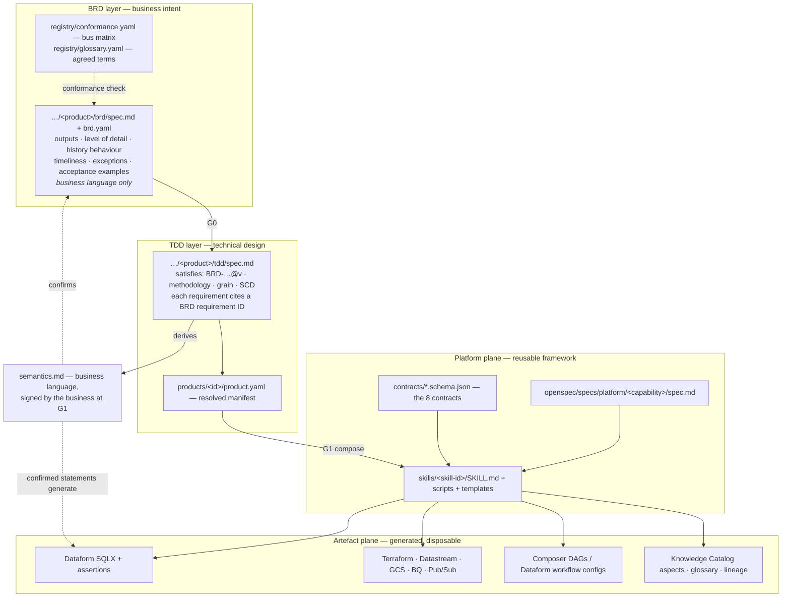

# Data Product Framework — Build Plan

> [!NOTE]
> **Status: design plan (September 2026).** This is the original plan. The repository now
> implements it, and where the two differ the implementation and
> [`docs/user-guide.md`](user-guide.md) are authoritative. Known differences:
> the `direct` pack is the default methodology (Kimball is opted into per layer with an ADR);
> the worked example (§12) is BRD-SALES-002 v1.2.0 and uses an outbound watermark extractor
> (ADR-015, ADR-SALES-002-02) on an hourly cadence rather than Datastream CDC every 15 minutes;
> the contract registry has 22 contracts, not 8; G2 (compose and acceptance mapping) sits
> between G1 and G3; and the monitor stage (`dpf monitor`) closes the loop by opening an
> OpenSpec change on a breach. Sections 13, 13.1, 13.2 and 14 are updated to the as-built state.

**The Data Product Framework (DPF)** — an OpenSpec-anchored, skill-composable framework for specifying, designing, building and governing data products on Google Cloud.

**Author:** Matt Turner (Data Analytics)
**Date:** 2026-09-09 · **Version:** 0.4
*v0.2 — BRD → TDD → Build lifecycle and completeness gating. v0.3 — renamed to the Data Product Framework; methodology promoted to a pluggable plane (§6). v0.4 — **BRD and TDD are two separate specs** with their own authors, versions and approvers; the BRD is business-authored and carries no modelling vocabulary; grain, SCD type, conformance and methodology are **derived in the TDD** and confirmed via a signed, business-language `semantics.md`.*
**Status:** Draft for review

> **The data product is the atomic unit of the framework.** Every BRD scopes one data product, every TDD resolves one data product, every pipeline exists to serve one, and the lifecycle ends with that product registered, versioned and accepted in Knowledge Catalog. Pipelines are a means; the product is the deliverable.

---

## 1. What we are building, in one paragraph

A repository where a data product is described first as a **business requirement** (what and why, including grain, history and service levels), promoted only when that requirement is provably complete, then resolved into a **technical design** (how) that selects and wires composable skills from across the Extract/Load/Transform lifecycle, and finally **built** into real Google Cloud artefacts — Dataform SQLX, Terraform, Datastream config, Composer DAGs, Knowledge Catalog registrations. Behaviour lives in OpenSpec. Composability is enforced by typed contracts between skills. Nothing gets built that cannot be traced back to a business requirement, and no business requirement can be signed off with the questions that matter still open.

**The example you gave, expressed in the framework:**

```
BRD-SALES-001  (what/why: grain, history, latency, SLOs, classification)
   │  G0 completeness gate
   ▼
TDD-SALES-001  (how: skill selection + parameters, every choice citing a BRD requirement ID)
   │  G1 coverage + traceability gate
   ▼
extract-rdbms-cdc → load-gcs-raw-zone → load-bq-raw-table
   → transform-raw-to-staging
     → kimball/model-scd + kimball/model-transaction-fact   (active methodology pack)
       → transform-silver-to-gold-product
         → publish-data-product + register-knowledge-catalog
```

---

## 2. Design principles

| # | Principle | Consequence |
|---|---|---|
| P1 | **Business intent is the source of truth; design is derived; code is disposable** | BRD → TDD → artefacts, in that order, with traceability both ways. |
| P2 | **The BRD holds business need; the TDD holds all modelling and mechanism** | The BRD is authored by a business SME and contains no modelling vocabulary. Grain, SCD type, conformance and methodology are *derived* in the TDD — then played back in business language for confirmation (§5.3). |
| P3 | **Completeness is machine-checked, not review-checked** | Completeness means *every question the design depends on has been answered by the business* — not that technical decisions are made. A BRD that never asked the history question fails a validator. |
| P4 | **Two specs, one binding** | BRD and TDD are separate specs with separate authors, versions and approvers, bound by `satisfies:` and the traceability matrix. No orphans in either direction. |
| P5 | **Contracts make skills composable** | Typed JSON Schema at every hop; composition is validated before a job runs. |
| P6 | **Registry-driven, never per-customer hardcoding** | Source systems, entities, conformance live in config. Sample sources are fixtures, not specifications. |
| P7 | **Deterministic work in scripts, judgement in the LLM** | Skills ship generators; the engineer and agent decide grain and SCD strategy in the TDD, the script emits reproducible SQL. |
| P8 | **Confirmed semantics generate tests** | Each statement in the signed `semantics.md` compiles to a Dataform assertion or quality rule. What the business agreed to *is* the test. |
| P9 | **Governance is a stage, not an afterthought** | Catalog registration and classification are gated steps; a product cannot be `published` without them. |

---

## 3. The lifecycle: BRD → TDD → Build

### 3.1 Mapping onto OpenSpec's native artefacts

Each data product carries **two specs** — a BRD spec and a TDD spec — plus the generated build. Both specs are source of truth in their own right and both evolve through delta change proposals.

| Layer | Question | OpenSpec artefact | Owner | Language |
|---|---|---|---|---|
| **BRD spec** | Why are we building this, and what does the business need? | `openspec/specs/products/<domain>/<product>/brd/spec.md` + `brd.yaml` | Business SME / analyst, facilitated by a data engineer | Business only. Outputs, level of detail, history behaviour, timeliness, exceptions, sensitivity. **No grain, no SCD, no BigQuery.** |
| **TDD spec** | How will we satisfy it, and on which services? | `openspec/specs/products/<domain>/<product>/tdd/spec.md` + `products/<id>/product.yaml` | Data engineer, agent-assisted | Technical. Methodology, grain, SCD, keys, conformance, services, cost. Declares `satisfies: BRD-…@<version>`. |
| **Semantics** | What will the business actually receive? | `…/<product>/semantics.md` | Derived from the TDD, **signed by the business** | BRD language, TDD content. The one document both parties read (§5.3). |
| **Build** | Do it, and prove it. | `openspec/changes/<id>/tasks.md` + `generated/<id>/**` | Agent, reviewed by engineer | Artefacts only. Regenerable from BRD + TDD. |

A change proposal may carry deltas against the BRD spec, the TDD spec, or both. On archive the deltas merge into their respective specs and the generated artefacts become deployed state.

### 3.2 Three kinds of spec

| Spec family | Location | Written | Example requirement |
|---|---|---|---|
| **Platform capability** | `openspec/specs/platform/<capability>/spec.md` | Once, reused by every product | `model-integration-layer` SHALL enforce a declared grain and history semantics; the active methodology pack supplies the legal model roles |
| **Product BRD** | `…/products/<domain>/<product>/brd/spec.md` | Per product, by the business | Users SHALL be able to drill from segment totals to an individual line on a customer order |
| **Product TDD** | `…/products/<domain>/<product>/tdd/spec.md` | Per product, by engineering | The fact SHALL be modelled at grain `(order_id, order_line_no)` using a Kimball transaction fact, satisfying BRD R-3 |

Platform capabilities define what the *framework* can do. The BRD declares what *the business* needs. The TDD is the join: it selects the methodology and the platform capabilities — and therefore the skills — that satisfy the BRD.

### 3.3 The promotion gates

A change cannot move to the next layer until its gate passes. Each gate has an automated half and, where it matters, a named human half.

| Gate | Promotes | Automated checks | Human sign-off |
|---|---|---|---|
| **G0 BRD-ready** | Draft → approved BRD spec | Completeness rubric (§4.2) green — every question the design depends on has a business answer; ≥1 acceptance example per business question; zero unowned open questions; no unexplained source-field naming (§4.4) | **Business owner** (data steward consulted, not a blocker) |
| **G1 TDD-ready** | BRD spec → TDD spec | `satisfies:` names a current BRD version (stale TDDs blocked); every BRD requirement traced to ≥1 derivation, decision and skill; zero orphan design decisions; feasibility pass against real source metadata; methodology × engine combination supported (§7.1); contract DAG type-checks; ADR for every non-default choice; cost estimate | Data engineering lead **and** a **formal business go** on `semantics.md` |
| **G2 Build-ready** | TDD spec → tasks | `tasks.md` derived from the TDD; every statement in `semantics.md` mapped to an executable check | — |
| **G3 Artefact** | Build → mergeable | `dataform compile`, `bq --dry_run` on every model, `terraform validate`/`plan`, DAG import test, golden-fixture diff | Code review |
| **G4 Acceptance** | Merged → published | Deployed to sandbox, seeded fixtures, all BRD acceptance examples and `semantics.md` statements pass, quality scans pass, catalog entry complete | Business owner accepts |

Only G4 flips a product's status to `published`. Until then it is `provisional` and is registered in Knowledge Catalog as such, so nobody downstream builds on something that hasn't been accepted.

---

## 4. What "complete" means — the BRD rubric

### 4.1 Who writes it, and what follows from that

The BRD is authored by a **business SME or business analyst**, facilitated by a data engineer. That single fact constrains everything about it:

- It contains **no modelling vocabulary**. No grain, no SCD, no conformed dimension, no additivity, no surrogate key. If a term would need explaining to the SME, it does not belong in the BRD.
- It is usually **framed around a desired output** — a report, a dashboard, an extract — and often **anchored to what the author believes exists in the source system**. That is normal and the framework must accept it rather than wish it away (§4.3).
- Its job is not to specify the model. Its job is to **capture business need precisely enough that the model can be derived and then confirmed**.

The rubric therefore tests one thing: *has the business been asked every question whose answer the design depends on?* Completeness is about the **questions answered**, not the technical decisions made.

### 4.2 Mandatory declarations — all business-answerable

| Group | Mandatory content | Why the design depends on it |
|---|---|---|
| **A. Purpose & consumers** | Business questions to be answered; the decisions they support; named consuming teams/systems | Without named consumers you cannot size service levels or judge breaking changes |
| **B. Required outputs** | The report/dashboard/extract; the figures and attributes wanted, in business words; the slices and filters; how the output is consumed | This is what the SME actually came to ask for — capture it verbatim |
| **C. Level of detail** | The finest level the user needs to drill to; whether two rows could ever describe the same thing | **This is what determines grain**, asked without the word |
| **D. History behaviour** | Per attribute that can change: "if it changes, should past figures follow it or stay as they were?"; how far back is needed | **This is what determines SCD type**, asked as a business question |
| **E. Timeliness & volume** | Freshness need **with business justification**; expected volumes and peaks | "Real time" without a justification is the most expensive sentence in data engineering |
| **F. Exceptions & edge cases** | Cancellations, refunds, amendments, reversals, back-dated corrections and how late they can arrive | Silently the largest source of rework; SMEs answer these well when asked |
| **G. Fitness & bad data** | What makes a row unusable to the business; whether bad data should stop publication or be flagged | Determines whether quality failures block or warn |
| **H. Sources believed to hold it** | Which systems the author believes hold the data; which system wins when two disagree | Authority ranking invented at build time is invented wrongly |
| **I. Protection & access** | Sensitivity, who may and may not see it, residency, retention | Drives classification, masking and sharing — expensive to retrofit |
| **J. Acceptance examples** | Worked examples in business language, ≥1 per business question | These become the tests (P8) and the confirmation script (§5.3) |
| **K. Scope** | Explicit non-goals | Without non-goals, scope creep has no boundary to violate |

Note what is **absent** versus v0.3: grain, measures-with-additivity, conformed dimension references, point-in-time declarations, SCD hints. All of those moved to the TDD, where they are derived.

### 4.3 Eliciting the model without modelling vocabulary

This is the mechanism that makes the split work. Each business question below is answerable by an SME, and each one determines a modelling decision they never see.

| Question asked in the BRD (business language) | What the TDD derives from the answer |
|---|---|
| "What is the finest level of detail you need to drill down to?" | **Grain** |
| "Could two rows ever describe the same thing? What makes each one distinct?" | **Grain columns / uniqueness assertion** |
| "If a customer moves segment, should last quarter's sales move with them, or stay as they were?" | **SCD type** (2 if they stay, 1 if they move) |
| "Do other teams report on 'customer' too? Must your numbers agree with theirs?" | **Conformance requirement** and bus matrix binding |
| "Can these figures be added up across months? Across regions?" | **Additivity** (additive / semi-additive / non-additive) |
| "How late can a correction to a past sale arrive?" | **Restatement window** and partitioning strategy |
| "If an order line is cancelled, should it disappear or stay visible?" | **Row retention rule** and measure exclusion logic |
| "Do you need a figure for every day, even days with no activity?" | **Fact type** (transaction vs periodic snapshot vs factless) |
| "Is this a count of events, or a state measured at a point in time?" | **Fact type** and additivity |

`author-brd` runs exactly these questions. The G0 validator checks that each has an answer — not that the answer is technically correct, which is the engineer's job at G1.

### 4.4 The source-anchored BRD problem

Your point that BRDs are "usually based on what's available in the source system" is the single most common quality issue in real requirements, and the framework handles it explicitly rather than pretending otherwise.

Two failure modes, both detected by `validate-brd`:

| Failure mode | Example | How it is handled |
|---|---|---|
| **Field-naming instead of need-stating** | "Include `ORDER_TYPE` and `STATUS_CD`" | Flagged in the gap register: *"BRD names a source field rather than a business need. What question does this field answer?"* The TDD records the field as evidence, not as the requirement |
| **Scope silently limited by the source** | Segment history requested, but the source only holds current segment | The TDD's feasibility check raises it, and it returns to the business as an explicit trade-off — **not** an engineering workaround decided in silence |

The second is important: **a BRD anchored to source reality can under-ask.** So `resolve-tdd` performs a feasibility pass against actual source metadata and, where a business need cannot be met from the available sources, generates a *business-language issue* rather than quietly degrading the requirement. Discovering at design time that segment history was never captured is worth far more than discovering it at UAT.

### 4.5 A BRD in business language

```yaml
---
brd_id: BRD-SALES-001
product_id: sales_performance
status: draft                      # draft → review → approved
business_owner: ...
data_steward: ...
domain: sales
sensitivity: OFFICIAL:Sensitive

business_questions:
  - id: BQ-1
    text: Which customer segments drove net sales growth this quarter?
    decision_supported: quarterly segment investment allocation
    consumers: [exec-reporting, sales-ops]

required_outputs:
  - id: OUT-1
    type: dashboard
    figures: [net sales, units sold]
    attributes: [customer segment, product category, region, month]
    slices: [customer segment, product category, region]

level_of_detail:
  drill_to: an individual line on a customer order
  distinct_by: each line on each order appears once

history_behaviour:
  - id: HB-1
    attribute: customer segment
    question: If a customer moves segment, should past sales follow them?
    answer: No — past sales keep the segment that applied at the time

timeliness:
  freshness_need: within 15 minutes of the sale being recorded
  justification: sales ops re-allocate leads intraday; staleness beyond 30 minutes causes duplicate outreach

exceptions:
  - Cancelled order lines must remain visible but must not count toward net sales
  - Corrections to a sale can arrive up to 90 days afterwards

fitness:
  unusable_row: no customer recorded, or a negative quantity
  on_bad_data: stop and alert — do not publish

sources_believed:
  - system: Oracle ERP
    holds: orders, order lines, customers, products, sales reps
    authority: system of record for sales

acceptance_examples:
  - id: AX-1
    text: A customer classified SMB in March and Enterprise in June must still show March sales under SMB.
  - id: AX-2
    text: An order line cancelled in April must be visible in the April detail but excluded from April net sales.

non_goals:
  - Forecasting or pipeline reporting
  - Margin and cost analysis

open_questions: []
---
```

Every field above is answerable by a business analyst. Not one requires knowledge of data modelling.

### 4.6 Open questions, assumptions and honest promotion

Real BRDs are never complete first pass, so the framework must handle incompleteness without either lying or stalling.

- Unknowns are written as `[NEEDS-DECISION: id]` markers and collected into an open questions register. The validator counts them.
- **G0 blocks on any open question that is unowned.** To promote with one still open you must record an owner, a due date, a **default assumption**, and the blast radius if the assumption proves wrong.
- Every promoted assumption is tagged in the TDD (`ASSUMPTION-3`) and carried into generated artefacts as a comment, so anything built on a guess stays findable.
- Products with live assumptions are registered `provisional` in Knowledge Catalog, with the assumptions visible as an aspect.
- **Auto-generated gap register:** `validate-brd` emits `gaps.md` listing every unanswered rubric question, phrased as the question to put to the business and who should answer it. That is the requirements workshop agenda, produced in seconds.

This is the difference between a completeness gate and a completeness fantasy: you may proceed on incomplete information, but only deliberately, attributably and visibly.

---

## 5. From BRD to TDD — derivation, then confirmation

### 5.0 The BRD and the TDD are two separate specs

Each data product has **two living specs**, not one spec plus a design note. Both are source of truth in their own right, both evolve through delta change proposals, both are archived and versioned — but they have different authors, different languages and different approvers.

| | **BRD spec** | **TDD spec** |
|---|---|---|
| Path | `openspec/specs/products/<domain>/<product>/brd/spec.md` | `openspec/specs/products/<domain>/<product>/tdd/spec.md` |
| Question | What and why | How |
| Author | Business SME / analyst, facilitated | Data engineer, agent-assisted |
| Language | Business only — no modelling vocabulary | Technical — methodology, grain, SCD, keys, services |
| Requirement IDs | `BRD-SALES-001/R-n` | `TDD-SALES-001/D-n` |
| Approver at gate | Business owner + data steward (G0) | Data engineering lead (G1) |
| Versioning | Own semver | Own semver, plus `satisfies: BRD-SALES-001@1.2` |

**The binding between them** is the `satisfies` declaration and the traceability matrix. Three properties fall out of it, and they are the practical reason to keep the specs apart:

1. **A TDD-only change needs no business re-approval.** Re-partitioning a fact, resizing a reservation or swapping Datastream for a Spark JDBC pull is a TDD delta with no BRD delta. Engineering lead approves and it ships. This is what stops the framework taxing routine technical work.
2. **A BRD change forces TDD impact analysis.** When the BRD moves to `1.3`, every TDD declaring `satisfies: …@1.2` is automatically marked **stale** and must be re-resolved and re-approved before build. Business intent cannot drift away from the design silently.
3. **Each side is reviewable by the people who can actually review it.** The SME reads a document with no BigQuery in it; the engineering lead reads one with no marketing in it.

`semantics.md` (§5.3) sits between the two: derived from the TDD, written in BRD language, signed by the business. It is the only document both parties read.

The TDD spec is where **all** modelling and mechanism lives — methodology, grain, SCD types, conformance, keys, services, partitioning, orchestration — and every requirement in it cites the BRD requirement it serves.

### 5.1 The derivation table

| BRD answer (business language) | TDD derivation (how) | Skill selected |
|---|---|---|
| Drill to "an individual line on a customer order"; each line appears once | **Grain:** one row per order line; grain columns `(order_id, order_line_no)`; uniqueness assertion generated | `kimball/model-transaction-fact` |
| "Past sales keep the segment that applied at the time" (HB-1) | **SCD Type 2** on `dim_customer`; full CDC op stream landed and applied by `MERGE`, since Datastream native BQ mode yields current state only | `load-gcs-raw-zone`, `kimball/model-scd` |
| Conformed reporting; BI consumers; agreed enterprise dimensions | **Methodology:** Kimball in silver, `direct` in gold (a departure from the `direct` default, recorded in ADR-SALES-002-01) | methodology pack selection |
| Freshness 15 min, justified by intraday lead re-allocation | CDC over micro-batch; Datastream; 15-minute workflow cadence | `extract-rdbms-cdc`, `orchestrate-pipeline` |
| "Corrections can arrive up to 90 days afterwards" | Partition on transaction date; 90-day restatement window; partition-scoped backfill | `orchestrate-pipeline` |
| "Cancelled lines visible but excluded from net sales" | Row retained with status flag; exclusion enforced in the gold semantic layer, not left to the consumer | `transform-silver-to-gold-product` |
| Consumers outside the GCP organisation | BigQuery sharing listing rather than authorized view | `publish-data-product` |
| "No customer recorded or negative quantity" = unusable; stop and alert | Quality rules at block severity, bound to the orchestration gate | `govern-data-quality` |
| Sensitivity OFFICIAL:Sensitive; analysts must not see contact details | Policy tags, masking, row access policy | `govern-classify-protect` |

Roughly two-thirds of a TDD is mechanically derivable from a well-answered BRD. **That is the real argument for the completeness gate: the better the business was questioned, the less of the design is invention.** The remaining third — partitioning, reservation sizing, CDC apply strategy per entity, escape hatches — is genuine engineering judgement, and each such decision gets an ADR.

### 5.2 Feasibility check against real sources

Before the design is accepted, `resolve-tdd` validates every derivation against actual source metadata: does the source hold segment history at all? Is there a reliable change timestamp? Is the natural key genuinely unique? Failures become **business-language issues** returned to the BRD owner, not silent engineering compromises (§4.4).

### 5.3 Semantic playback — the business confirms what it will get

This is what replaces "grain lives in the BRD", and it is stronger, because it is written in language the SME can actually check.

Once the model is derived, `resolve-tdd` generates `semantics.md` — a **business-language statement of what the product will actually mean**, for sign-off at G1:

> **What you will receive**
> - One row for every line on every customer order. An order with three lines produces three rows.
> - Each order line appears exactly once, even if it was amended several times; the figures reflect the latest amendment.
> - Cancelled lines remain visible and are marked as cancelled. They are **not** counted in net sales.
> - Sales stay with the customer segment that applied on the date of the sale. If a customer moves segment later, past sales do not move with them.
> - Corrections arriving within 90 days of the sale will restate the affected days. Corrections after 90 days will not.
> - Figures can be added up across days, products, regions and segments.

Three consequences, and together they recover everything moving grain out of the BRD would otherwise have cost:

1. **The SME can verify it without understanding modelling.** Every line is checkable against their own acceptance examples. Nobody has to explain what SCD2 is.
2. **`semantics.md` is versioned and signed, and lives with the product.** A later grain, history or exclusion change alters this document, which forces business re-confirmation and impact analysis — the same protection v0.3 got from putting grain in the BRD, without pretending the SME authored it.
3. **Each statement compiles to a test.** "Each order line appears exactly once" becomes the grain assertion; "not counted in net sales" becomes a semantic rule in gold; "sales stay with the segment at the date" becomes the SCD2 regression test.

### 5.4 Traceability, enforced both directions

`dpf trace` generates the matrix:

```
BRD answer → derived semantics (semantics.md) → design decision → skill → artefact → test → last run
```

Two blocking failures at G1:

- **Orphan requirement** — a BRD business question with no derivation, no design decision or no test. Something asked for is not being built.
- **Orphan design** — a design decision citing no BRD requirement. Something is being built that nobody asked for. This answers "why is this in the design?" with evidence instead of debate.

At G4 the matrix doubles as the acceptance pack: per business question, the test that proves it and when it last passed.

---

## 6. The methodology plane — how "I want a star schema" becomes a set of skills

### 6.1 Why methodology is a plane, not an assumption

In v0.1 Kimball was baked into skill names (`transform-staging-to-dim-scd2`), which quietly meant the framework could only ever build star schemas. That is wrong for two reasons: Australian public sector work regularly demands Data Vault for auditability, and analytics/ML consumers frequently want one big table, not a star.

So **modelling methodology becomes a selectable, pluggable pack**. Saying "this product uses Kimball" activates a coherent bundle: the vocabulary, the design process, the required declarations, the skills, the validation rules and the anti-pattern critiques. Saying "this one uses Data Vault" activates a different bundle through the same interfaces. The rest of the framework — extract, load, publish, govern, catalog — does not change at all.

**Every methodology is optional, including having one at all.** Plenty of products need no formal modelling method: the customer wants the raw tables typed and renamed, a business view over the top using structs and nested arrays, and perhaps that view materialised. That is a legitimate design, it is BigQuery-native, and the framework treats it as a first-class path (§6.3) rather than as a gap.

The governing rule, and the one worth repeating to customers:

> **A methodology is a cost paid for a benefit. Do not pay it without the benefit.**

Dimensional and vault modelling buy conformance, history and auditability. If a product needs none of those, the modelling ceremony is pure overhead — and steering a customer into a star schema they did not need is a worse outcome than having no methodology plane at all.

### 6.2 What a methodology pack contributes

A pack is not a template library. It contributes seven things, and the first three are the ones that actually matter:

| # | Contribution | Kimball example |
|---|---|---|
| 1 | **TDD required declarations** — what the TDD spec must state when this methodology is active | Business process; grain per fact; conformed dimension bindings; measures with additivity; SCD type per dimension |
| 1b | **BRD elicitation questions** — extra *business-language* questions added to the BRD interview, never modelling vocabulary | "If this attribute changes, should past figures follow it?" (→ SCD type); "must your numbers agree with other teams'?" (→ conformance) |
| 2 | **Design process** — the ordered questions `author-brd` asks, in methodology order | Kimball's four steps: select the business process → declare the grain → identify the dimensions → identify the facts |
| 3 | **Model role vocabulary** — the legal roles a model can take | `dimension`, `fact`, `bridge`, `outrigger`, `junk`, `degenerate` |
| 4 | **Transform skills** — one per role/pattern, contributed into the skill catalogue | `kimball/model-transaction-fact`, `kimball/model-scd`, … |
| 5 | **Design rules** — machine-checkable invariants run at G1 and G3 | Every fact FK resolves to a dimension row including the unknown member; a dimension has exactly one grain and one surrogate key |
| 6 | **Artefact templates** — SQLX patterns the skills instantiate | SCD2 merge, late-arriving dimension handling, date dimension generator |
| 7 | **Anti-pattern critiques** — what `review-model-design` flags | Mixed-grain fact; dimension attributes stored on the fact; SCD2 where no consumer queries history; surrogate key equal to the natural key |

Contributions 1 and 1b are the subtle part, and they respect the BRD/TDD split. A pack **never adds modelling vocabulary to the BRD**. What it adds there is *business questions* — because different methodologies depend on different business facts. Kimball needs the history question ("should past figures follow a change?"); Data Vault needs source-authority and record-provenance questions; an activity schema needs event-identity questions. The pack extends the **TDD** checklist with modelling declarations, and extends the **BRD interview** with the plain-language questions whose answers those declarations require.

### 6.3 The direct path — no methodology

The most common request in practice: *take the raw tables, put a business view on top, maybe materialise it.* This is the `direct` pack.

**Why it is engineering-legitimate, not just expedient.** BigQuery is columnar and handles nested data natively, so a 1:N relationship can be modelled as `ARRAY<STRUCT>` on the parent rather than split into a fact and a dimension. That preserves the relationship, removes the join, and avoids surrogate-key machinery entirely. For a single-source product with one consumer group and no cross-domain conformance requirement, a dimensional decomposition adds cost and buys nothing.

**What "no methodology" does *not* mean.** The framework's non-negotiables still apply in full:

| Still required | Why |
|---|---|
| A declared, asserted **grain** | A business view has a grain too — one row per customer, per order, per claim. The uniqueness assertion is generated exactly as it is for a fact |
| **`semantics.md`**, signed | The business still confirms what it will receive before build |
| `semantic-model.v1` **contract** emitted | So gold, publish, catalog and quality skills work unchanged |
| Quality, classification, catalog registration, SLOs | Governance is not a function of modelling method |

So this is *no methodology*, not *no design*. It skips restructuring, not rigour.

```
methodologies/direct/
├── METHODOLOGY.md            # when this is the right answer — and when to graduate
├── methodology.yaml          # roles: typed_source · business_view · materialised_view
├── skills/
│   ├── model-typed-source/       # types, business naming, null and reject policy
│   ├── model-business-view/      # business logic, derived fields, filters, semantics
│   ├── model-struct-shaping/     # 1:N → ARRAY<STRUCT>; nesting depth and access rules
│   └── model-materialisation/    # view vs materialized view vs scheduled table
├── rules/
│   ├── grain-declared-and-asserted.rule   # shared with every pack
│   ├── nesting-depth-limit.rule           # deep nesting hurts consumers and BI tools
│   └── view-chain-depth-limit.rule        # stacked views are the classic silent cost bomb
└── templates/*.sqlx
```

#### The materialisation decision

`direct/model-materialisation` makes this an explicit, recorded TDD decision rather than a habit:

| Option | Choose when | Trade-off |
|---|---|---|
| **View** | Low query volume; freshness matters more than latency; cheap upstream | Full compute on every read; cost scales with consumers |
| **Materialized view** | Repeated aggregation over a stable base table; automatic incremental refresh is acceptable | SQL restrictions apply — **verify current BigQuery limits at design time**, they have changed repeatedly |
| **Scheduled table build** (Dataform) | Complex logic, heavy joins, or predictable refresh windows | Staleness between runs; storage cost; needs orchestration |

The BRD's freshness answer and expected query volume drive this directly — another case where a well-answered BRD removes an argument.

#### Graduation triggers

The pack documents when `direct` stops being the right answer, so teams migrate deliberately instead of discovering the limit in production:

| Signal | Graduate to |
|---|---|
| A second source must agree on the same entity; numbers must reconcile across domains | **Kimball** (conformed dimensions) |
| Consumers need "as at the time" attribution rather than current state | **Kimball** SCD2, or a vault satellite |
| Audit or reconstruction obligations; many volatile sources; source truth must be replayable | **Data Vault 2.0** |
| View chains deepening, or query cost climbing with consumer count | Materialise first, then reconsider the model |

Because methodology lives in the TDD, **graduating is a TDD-only change** — and if the derived semantics are unchanged, `semantics.md` still reads the same and the business need not re-approve anything. That is exactly the property the two-spec split was designed to give you.

### 6.4 The Kimball pack

```
methodologies/kimball/
├── METHODOLOGY.md              # doctrine: when to use, when not to, core concepts
├── methodology.yaml            # roles, required BRD declarations, naming standards, rule bindings
├── brd-extension.schema.json   # the rubric fields this methodology adds
├── process.yaml                # the four-step design interview
├── skills/
│   ├── design-bus-matrix/          # conformed dimension planning across products
│   ├── model-date-dimension/       # generated, with fiscal + AU public holiday calendars
│   ├── model-conformed-dimension/
│   ├── model-scd/                  # types 1, 2, 3, 6; unknown + late-arriving members
│   ├── model-junk-dimension/
│   ├── model-role-playing-dimension/
│   ├── model-transaction-fact/
│   ├── model-periodic-snapshot-fact/
│   ├── model-accumulating-snapshot-fact/
│   ├── model-factless-fact/
│   └── model-bridge-hierarchy/
├── rules/
│   ├── grain-declared-and-asserted.rule
│   ├── fact-fk-integrity.rule          # incl. mandatory unknown member, no null FKs
│   ├── dimension-single-grain.rule
│   ├── surrogate-key-required.rule
│   ├── additivity-declared.rule
│   └── no-fact-to-fact-join.rule
├── templates/*.sqlx
└── references/                 # SCD type decision table, fact type decision table, conformance guidance
```

Two things worth noting. First, the skills are **named for Kimball concepts**, which is exactly what you asked for — "I want a star schema" resolves to a known, named set of skills, and an engineer who knows Kimball recognises every one of them. Second, `process.yaml` means the four-step method drives the BRD interview, so the business conversation follows the discipline rather than the discipline being retrofitted afterwards.

### 6.5 Methodology applies per layer

This is the nuance that stops the plane becoming a straitjacket. Methodology is not one choice per product — it is one choice per layer:

| Layer | Methodology concern | Options |
|---|---|---|
| **Raw / bronze** | None. Source-shaped, append-only, immutable. Fixed by the framework. | — |
| **Silver — integration** | How sources are integrated and history is kept | **Direct** (typed staging + business view, no restructuring) · Kimball dimensional · Data Vault 2.0 raw vault · Activity schema · Property graph · 3NF |
| **Gold — consumption** | How the product is shaped for its consumers | **Structured/nested business view, optionally materialised** · Star (consumption) · One big table · Metric/semantic layer · Feature table · Vector + passage store |

The common enterprise pattern — **Data Vault silver for auditability, Kimball marts in gold** — is expressible because the two are separate declarations:

```yaml
silver:
  methodology: data-vault-2
gold:
  pattern: kimball-star
```

Equally, `silver: kimball` + `gold: obt` covers the "star for governance, wide table for Looker and ML" case. The contract between the layers is what makes this legal: silver emits `semantic-model.v1` regardless of methodology, and gold consumes it.

### 6.6 How a methodology gets selected

**Question zero: does this product need a methodology at all?**

| Signals | Answer |
|---|---|
| Single source; one consumer group; no requirement to reconcile with other teams; current state is enough | **`direct`** — typed staging plus a business view, optionally materialised (§6.3) |
| Several sources must agree on shared entities; self-service BI; numbers must reconcile across domains | **Kimball** |
| Audit, reconstruction or regulatory replay; many volatile sources; source truth must survive schema change | **Data Vault 2.0**, usually with Kimball marts in gold |
| Behavioural events, funnels, sessionisation | **Activity schema** |

`direct` is the correct default for a simple product, and `resolve-tdd` recommends it unless a signal in the BRD justifies the extra cost. Choosing a heavyweight methodology for a product that does not need one is a design defect, and `review-model-design` flags it as such.

**Methodology is chosen in the TDD.** It is a *how*, it is chosen by engineering, and it is recorded as a TDD declaration with an ADR. The BRD never names one — it would be meaningless to the SME who wrote it.

1. **A platform default** is set in `registry/platform-defaults.yaml` (`direct` for every layer; a domain may override it). Its only role before the TDD exists is to tell `author-brd` **which business questions to ask** (§6.2, contribution 1b).
2. **The BRD supplies signals, not choices**: consumption pattern, audit obligations, source volatility, history behaviour, whether numbers must agree with other teams.
3. **`resolve-tdd` recommends** a per-layer methodology from those signals and either confirms the domain default or proposes a deviation.
4. **The engineer decides.** Saying "I want a star schema" is a perfectly legitimate TDD decision — the framework simply records it as a decision with a rationale rather than an unexamined habit, and a deviation from the domain default needs an ADR and lead sign-off at G1.

Because methodology sits in the TDD, **changing it is a TDD-only delta** where the business outcome is unchanged. Re-platforming silver from Kimball to Data Vault without altering what the business receives requires no BRD change — only a re-confirmation that `semantics.md` still reads the same.

**Selection heuristics** encoded in `resolve-tdd`:

| BRD signal | Recommended methodology |
|---|---|
| Single source, single consumer group, current state sufficient, no cross-domain reconciliation | **`direct`** (silver + gold) — the default |
| Conformed reporting across domains; BI/self-service consumers; agreed enterprise dimensions | **Kimball** (silver + gold) |
| Heavy audit and reproducibility obligations; many volatile sources; source-system truth must be reconstructible; frequent source schema change | **Data Vault 2.0** silver, Kimball gold |
| Single known consumer; wide analytical scans; ML feature preparation; cost-sensitive query patterns | Kimball silver, **OBT** gold |
| Behavioural/event analytics; funnels, sequences, sessionisation | **Activity schema** silver |
| Relationship traversal, entity resolution, network questions | **Property graph** silver (BigQuery Graph / GQL) |
| Unstructured retrieval with citation requirements | **Document-semantic** silver (chunks + embeddings + provenance) |

### 6.7 Pack roadmap

| Pack | Phase | Rationale |
|---|---|---|
| `direct` | 2 | The most common real-world path and the **default**; smallest possible pack, so it validates the interface without ceremony |
| `kimball` | 2 | The vertical slice; proves the interface carries a heavyweight methodology too |
| `obt` (one big table) | 3 | High demand for BI and ML consumers; validates that a further pack costs days not weeks |
| `activity-schema` | 3 | Lands naturally alongside the streaming content types |
| `data-vault-2` | 3 | **Pulled forward from Phase 5** — real customer demand, and it is the pack that most stresses the interface. Different vocabulary, different declarations, different rules |
| `property-graph` | 5 | BigQuery Graph / GQL; pairs with entity resolution work |
| `document-semantic` | 5 | Pairs with the unstructured content type |
| `3nf-inmon` | Deferred | Add only on genuine customer demand |

**Acceptance test for the abstraction:** `direct` and `kimball` shipping together in Phase 2 — one trivial, one heavyweight — must share the pack interface with **zero special-casing**, and adding `obt` or `data-vault-2` in Phase 3 must require **zero changes** to extract, load, publish, govern or catalog skills. Building the smallest and the largest pack first is deliberate: it is the cheapest way to find out whether the interface is real.

### 6.8 What this changes elsewhere in this plan

| Area | Change from v0.2 |
|---|---|
| Capabilities (§9) | `model-dimension` and `model-fact` are replaced by methodology-neutral `model-integration-layer` and `model-consumption-layer`, plus two new capabilities: `methodology-pack` (what a pack must provide) and `select-methodology` (selection and deviation rules) |
| Skills (§10) | `transform-staging-to-dim-scd2` and `transform-staging-to-fact` move into the Kimball pack as `kimball/model-scd` and `kimball/model-transaction-fact`; the core catalogue keeps only methodology-neutral transform skills (`transform-raw-to-staging`, `transform-silver-to-gold-product`, `transform-nonsql-heavy`) |
| Contracts (§11) | `semantic-model.v1` is generalised to **`semantic-model.v1`**, carrying `methodology`, `role` (valid roles supplied by the pack), and the universal fields every methodology needs: `grain_statement`, `grain_columns`, `brd_requirement_id`, `natural_key`, `history_semantics` |
| BRD rubric (§4.2) | Group B becomes *core declarations plus the active methodology's extension*, resolved at validation time from `registry/brd-rubric.yaml` and the pack's elicitation questions |
| Repo layout (§13) | New top-level `methodologies/` tree; `registry/platform-defaults.yaml` for defaults |
| Delivery plan (§15) | New Phase 2 task: define the pack interface **before** writing Kimball skills, so the first pack is not accidentally the interface. New Phase 3 task: `obt` pack as the abstraction test |
| ADRs (§16) | New **ADR-011 Methodology plane**: packs are pluggable; `direct` is the default; per-layer selection; deviation requires an ADR |

The important sequencing point: **build the pack interface first, then Kimball as its first implementation.** If Kimball is written first and the interface is reverse-engineered from it, every later pack will fight the abstraction.

---

## 7. Engine and storage options — pluggable, not mandated

Methodology (§6) decides what *shape* the data takes. Two further choices are independent of it and of each other, and neither is a platform mandate:

- **Transform engine** — what executes the transformation.
- **Storage format** — where the data physically lands.

Both are recorded per product and per layer in the TDD, with a decision table and an ADR. A customer already invested in dbt, or one running a genuine real-time pipeline, or one whose data must stay as Parquet in GCS, is accommodated without forking the framework.

### 7.1 Transform engines

| Engine | Choose when | Emits | Ph |
|---|---|---|---|
| **Dataform** *(default)* | BigQuery SQL, batch or micro-batch. No extra runtime, assertions and dependency graph built in | SQLX + assertions + workflow configs | 2 |
| **dbt** | Customer is already invested in dbt and the team's skills sit there | dbt models, tests, sources | 3 |
| **Dataflow (Beam)** | Genuine streaming / continuous transformation, sub-minute latency, windowed or stateful logic | Beam pipeline + templates | 3 |
| **Managed Service for Apache Spark** | Logic SQL cannot express; heavy non-SQL processing | Spark job | 4 |

**How pluggability actually works.** Methodology skills do not emit SQL directly. They emit the **semantic model** (`semantic-model.v1` — grain, roles, keys, history semantics), and an **engine adapter** renders that model into engine-specific artefacts. The methodology decides shape; the engine decides execution. One Kimball SCD2 definition can therefore render as Dataform SQLX or as a dbt snapshot without the pack knowing which.

**The honest constraint — engines are not interchangeable.** Streaming is a different execution model, not a SQL dialect swap, and pretending otherwise is how frameworks generate code that silently does not work:

| Methodology | Dataform | dbt | Dataflow (streaming) | Spark |
|---|---|---|---|---|
| `direct` | Yes | Yes | Yes | Yes |
| Kimball — transaction fact | Yes | Yes | Yes | Yes |
| Kimball — SCD2 dimension | Yes | Yes | **Hard** — needs stateful processing, late-arrival handling and a durable current-state store | Yes |
| Data Vault 2.0 | Yes | Yes | **Partial** — hubs and links stream cleanly; satellite history does not | Yes |
| OBT | Yes | Yes | Yes | Yes |
| Activity schema | Yes | Yes | Yes | Yes |

Each pack **declares which engines it supports per role**, and `compose-pipeline` refuses an unsupported combination at G1 rather than generating something that compiles and misbehaves. Where a pack wants to support streaming for a hard role, it must ship an explicit streaming variant — never an assumed one.

A common and sensible split: **Dataflow for the streaming ingest and enrichment path, Dataform for the modelled layers**, with the streaming path landing into a raw or current-state table that the batch models build on. The framework supports mixing engines across layers within one product.

### 7.2 Storage formats

| Format | Choose when | Trade-off |
|---|---|---|
| **BigQuery native** *(default)* | Best performance and full DML; no external access requirement | Proprietary storage |
| **Apache Iceberg managed tables** | Open format required; multi-engine access; BigQuery still manages the table | Newer surface — verify current feature parity at design time |
| **GCS Parquet + external / Lakehouse table** | An existing lake; data must live in GCS as files; other engines write it | Query performance; no full DML guarantees |
| **GCS + object tables / ObjectRef** | Unstructured content — documents, images, audio | Processing model differs entirely |
| **Cross-cloud connections** (S3, Azure, Salesforce Data 360) | Data genuinely cannot move | Egress cost, latency, feature limits |

**Chosen per layer, not per product.** Raw may be GCS Parquet because that is how the source lands, silver BigQuery native for modelling performance, and a gold port exposed as Iceberg for an external engine. That is a legitimate and common configuration.

**Signals that drive the choice**, all traceable to BRD answers: residency constraints, who else consumes the data, whether non-BigQuery engines must *write* it, existing lake investment, and cost profile.

### 7.3 What this adds to the framework

| Area | Addition |
|---|---|
| Manifest | `product.yaml` declares `engine` and `storage` per layer, defaulting from `registry/platform-defaults.yaml` |
| Capability | New `select-engine-and-storage` — the decision rules and the compatibility matrix |
| Contracts | `raw-table.v1` and `semantic-model.v1` carry `storage_format` and `engine`; `compose-pipeline` type-checks both |
| Repo | `engines/<engine>/` adapters, mirroring `methodologies/<pack>/` |
| Gate G1 | An unsupported methodology × engine combination is a blocking validation error, not a warning |

The design rule that keeps this from sprawling: **packs never emit engine-specific artefacts, and engine adapters never make modelling decisions.** If either side starts knowing about the other, the plane has leaked.

---

## 8. Architecture — three planes plus a contract registry



**Contract registry.** Eight JSON Schemas — the piece OpenSpec does not give you and the piece that makes skills genuinely composable rather than a pile of prompts. Every skill validates its input against the consumed schema and emits the produced schema; `compose-pipeline` refuses to wire a hop whose contracts do not match.

**Artefact plane.** Fully regenerable. Deleting `generated/` and re-running from BRD + TDD must reproduce it byte-for-byte — that is a Phase 1 acceptance test, and it is what keeps the specs authoritative rather than decorative.

---

## 9. Platform capability taxonomy

Capabilities are named for behaviour, not tooling, so swapping Datastream for a Spark JDBC pull is a skill change, not a spec change.

| Group | Capability | Behaviour it pins down |
|---|---|---|
| Meta | `brd-completeness` | The rubric of §4: what a product spec must declare before promotion, and how gaps are reported |
| Meta | `traceability` | Bidirectional requirement↔design↔skill↔test coverage rules; orphan handling |
| Meta | `methodology-pack` | What a pack MUST provide: rubric extension, design process, roles, skills, rules, templates, critiques |
| Meta | `select-methodology` | Per-layer selection, domain defaults, deviation and ADR rules |
| Meta | `compose-pipeline` | Contract compatibility rules; manifest → skill DAG resolution |
| Meta | `openspec-conventions` | House rules for writing these specs |
| Extract | `extract-incremental-capture` | Watermarks, CDC ops, exactly-once, replay, backfill, schema-drift response |
| Extract | `extract-full-snapshot` | Snapshot consistency, cut-over to incremental |
| Extract | `extract-connection-security` | Secrets, private connectivity, least privilege, egress boundaries |
| Load | `land-immutable-raw` | Append-only, immutable, partitioned by ingest date, lineage columns, per-batch manifest |
| Load | `land-schema-evolution` | Additive vs breaking drift, quarantine, alerting |
| Transform | `conform-staging` | Typing, dedupe, null/PII handling, reject/quarantine, deterministic re-run |
| Transform | `model-integration-layer` | Methodology-neutral silver contract: grain enforcement, history semantics, natural/surrogate keys, conformance. The active pack supplies the legal roles and rules |
| Transform | `model-consumption-layer` | Methodology-neutral gold contract: output shape, semantic naming, aggregation and compatibility rules |
| Transform | `model-data-product` | Output ports, semantic naming, aggregation contract, backward compatibility |
| Transform | `enrich-unstructured` | Document parsing, structured extraction, embeddings, provenance to source page/clause |
| Publish | `publish-product-access` | Access model, sharing mechanism, versioning and deprecation |
| Govern | `register-catalog-metadata` | Required aspects, ownership, glossary binding, lineage completeness, provisional status |
| Govern | `enforce-data-quality` | Rule types, thresholds, gate behaviour on failure |
| Govern | `classify-and-protect` | Classification, policy tags, masking, row-level access |
| Operate | `orchestrate-pipeline` | Dependency ordering, retries, SLA, idempotent re-run, restatement windows |
| Operate | `observe-and-cost` | Freshness/volume/quality SLOs, cost attribution per product |

---

## 10. Skill catalogue and Google Cloud service mapping

Phase column refers to §15. **2** = vertical slice, **3** = breadth, **4** = hardening, **5** = unstructured/AI.

Skills below are **methodology-neutral**. Modelling skills are contributed by methodology packs (§6) and listed in §10.5.

### 10.1 Extract

| Skill | Content type | Primary GCP mapping | Alternates | Ph |
|---|---|---|---|---|
| `extract-rdbms-cdc` | Oracle, SQL Server, PostgreSQL, MySQL | **Datastream** → GCS or BigQuery | Debezium on Managed Service for Apache Kafka | 2 |
| `extract-rdbms-batch` | Same, watermark micro-batch | **Dataflow JDBC-to-BigQuery** template; Cloud Run job for small tables | Managed Service for Apache Spark for large parallel pulls | 2 |
| `extract-files-object-store` | CSV, JSON, Parquet, Avro, ORC | **GCS** + Storage Transfer Service | BigQuery Data Transfer Service (S3, Azure Blob) | 3 |
| `extract-stream-pubsub` | Events (JSON/Avro/Proto) | **Pub/Sub** + schema registry | — | 3 |
| `extract-stream-kafka` | Kafka topics | **Managed Service for Apache Kafka** + BigQuery sink connector | Dataflow Kafka→BQ | 3 |
| `extract-saas-api` | REST/GraphQL SaaS | **Cloud Run job** + Secret Manager; **Apigee** façade for unstable APIs | Application Integration; BigQuery Data Transfer Service connectors | 3 |
| `extract-crosscloud-query` | S3, Azure Blob, Salesforce Data 360 | **BigQuery cross-cloud connections** | Cross-cloud transfer | 3 |
| `extract-documents` | PDF, scans, images | **GCS** + BigQuery **object tables** / ObjectRef | Document AI batch | 5 |

### 10.2 Load / land

| Skill | Purpose | Primary GCP mapping | Ph |
|---|---|---|---|
| `load-gcs-raw-zone` | Immutable landing `raw/<system>/<entity>/ingest_date=…/batch_id=…` + JSON manifest | GCS, Autoclass, retention policy | 2 |
| `load-bq-raw-table` | Append-only raw table with `_ingest_ts`, `_batch_id`, `_source_system`, `_op`, `_source_pk_hash` | BigQuery load jobs / Storage Write API, partitioned + clustered | 2 |
| `load-bq-open-table` | Open-format raw for multi-engine access | **Apache Iceberg managed tables**; Lakehouse runtime catalog | 3 |
| `load-stream-bq-direct` | Low-latency landing | Pub/Sub BigQuery subscription; Storage Write API | 3 |
| `load-cdc-current-state` | Collapse CDC ops to current state | BigQuery `MERGE` via Dataform, or Datastream native BQ mode | 2 |

### 10.3 Transform

| Skill | Purpose | Primary GCP mapping | Ph |
|---|---|---|---|
| `transform-raw-to-staging` | Type cast, dedupe on PK + op ordering, null policy, quarantine rejects | **Dataform** SQLX + assertions | 2 |
| *(silver modelling)* | Supplied by the active methodology pack — see §10.5 | Dataform incremental SQLX | 2 |
| `transform-silver-to-gold-product` | Denormalised/aggregated product, semantic naming, output ports | Dataform + authorized views; BI Engine where relevant | 2 |
| `transform-unstructured-enrich` | Layout parse → structured rows → embeddings → vector index | `ML.PROCESS_DOCUMENT` (Document AI Layout Parser), `AI.GENERATE_TABLE`, `ML.GENERATE_EMBEDDING`, `VECTOR_SEARCH` | 5 |
| `transform-nonsql-heavy` | Escape hatch for logic SQL cannot express | **Managed Service for Apache Spark** | 4 |

### 10.4 Publish and govern

| Skill | Purpose | Primary GCP mapping | Ph |
|---|---|---|---|
| `publish-data-product` | Access model, versioned product datasets, deprecation policy | Authorized views/datasets, **BigQuery sharing**, IAM | 2 |
| `register-knowledge-catalog` | Aspects, ownership, glossary terms, lineage, provisional/published status | **Knowledge Catalog** aspect types, entries, glossary, lineage | 2 |
| `govern-data-quality` | Rules, thresholds, gating, scan scheduling | Knowledge Catalog data quality + profiling scans; Dataform assertions | 4 |
| `govern-classify-protect` | Classification → policy tags → masking / row access | Policy tags, column-level security, row access policies, DLP | 4 |
| `observe-pipeline-slo` | Freshness/volume/quality/cost SLOs and alerting | `INFORMATION_SCHEMA.JOBS`, Cloud Monitoring, Log Analytics | 4 |
| `orchestrate-pipeline` | Dependency graph, retries, SLA, restatement backfill | **Dataform** release + workflow configs; **Cloud Composer** for cross-service | 2 |

### 10.5 Methodology pack skills

Activated by the pack selected per layer (§6.5). "I want a star schema" resolves to the Kimball column.

| **`direct` pack (Ph 2) — the default** | Kimball pack (Ph 2) | Data Vault 2.0 pack (Ph 3) | OBT pack (Ph 3) |
|---|---|---|---|
| `direct/model-typed-source` | `kimball/design-bus-matrix` | `dv2/model-hub` | `obt/model-wide-table` |
| `direct/model-business-view` | `kimball/model-date-dimension` | `dv2/model-link` | `obt/model-nested-repeated` |
| `direct/model-struct-shaping` | `kimball/model-conformed-dimension` | `dv2/model-satellite` | `obt/model-partition-cluster-strategy` |
| `direct/model-materialisation` | `kimball/model-scd` (types 1/2/3/6) | `dv2/model-point-in-time` | |
| | `kimball/model-junk-dimension` | `dv2/model-bridge` | |
| | `kimball/model-role-playing-dimension` | `dv2/model-business-vault` | |
| | `kimball/model-transaction-fact` | | |
| | `kimball/model-periodic-snapshot-fact` | | |
| | `kimball/model-accumulating-snapshot-fact` | | |
| | `kimball/model-factless-fact` | | |
| | `kimball/model-bridge-hierarchy` | | |

Further packs on the same interface: `activity-schema` (Ph 3), `property-graph` (Ph 5), `document-semantic` (Ph 5).

### 10.6 Lifecycle and meta skills

| Skill | Purpose | Ph |
|---|---|---|
| `author-brd` | Interview-style BRD authoring against the §4 rubric; emits the gap register rather than guessing | 1 |
| `validate-brd` | Run the completeness rubric, conformance check and glossary resolution; produce `gaps.md` and the G0 verdict | 1 |
| `resolve-tdd` | Derive the TDD from an approved BRD: skill selection, parameters, contract wiring, ADR stubs, cost estimate — each citing a requirement ID | 1 |
| `trace-coverage` | Build the traceability matrix; fail on orphans in either direction | 1 |
| `compose-pipeline` | Resolve manifest → skill DAG, type-check contracts, invoke skills in order | 2 |
| `propose-data-change` | Author a delta change against an approved BRD with downstream impact analysis | 2 |
| `scaffold-capability` | Generate a new capability spec + skill skeleton + contract stub in house style | 3 |
| `select-methodology` | Recommend a per-layer methodology from BRD signals; flag deviation from the domain default | 2 |
| `review-model-design` | Critique the proposed model against the BRD **and the active pack's anti-pattern rules** | 4 |

---

## 11. The contract registry

| Contract | Key fields (abbreviated) | Produced by | Consumed by |
|---|---|---|---|
| `source-binding.v1` | `system_id`, `engine`, `connectivity`, `secret_ref`, `entities[]`, `capture_mode`, `watermark_column`, `schedule`, `authority_rank` | registry + TDD | all `extract-*` |
| `landing-manifest.v1` | `batch_id`, `source_system`, `entity`, `ingest_ts`, `watermark_low/high`, `row_count`, `checksum`, `schema_fingerprint`, `uri_prefix` | `extract-*`, `load-gcs-raw-zone` | `load-bq-*` |
| `raw-table.v1` | `table_ref`, `partition_spec`, `cluster_spec`, `lineage_columns[]`, `op_semantics`, `schema_fingerprint`, `is_append_only` | `load-bq-*` | `transform-raw-to-staging` |
| `staging-model.v1` | `table_ref`, `natural_key[]`, `dedupe_strategy`, `type_map`, `reject_table_ref`, `quality_gate` | `transform-raw-to-staging` | `transform-staging-to-*` |
| `semantic-model.v1` | `methodology` (direct\|kimball\|dv2\|obt\|…), `role` (legal roles supplied by the active pack — e.g. `business_view` and `materialised_view` for `direct`, `dimension`/`fact` for Kimball), **`grain_statement` + `grain_columns` (sourced from BRD, immutable at this layer)**, `brd_requirement_id`, `natural_key[]`, `surrogate_key`, `history_semantics`, plus a pack-scoped `attributes{}` block (e.g. `scd_type`, `fact_type`, `dim_refs[]`, `additivity` for Kimball) | methodology pack modelling skills | `transform-silver-to-gold-product` |
| `data-product.v1` | `product_id`, `version`, `brd_id`, `status` (provisional\|published), `owner`, `domain`, `output_ports[]`, `slo{}`, `classification`, `consumers[]`, `assumptions[]`, `deprecation_policy` | `transform-silver-to-gold-product` | `publish-*`, `register-*` |
| `catalog-registration.v1` | `entry_ref`, `aspect_types[]`, `glossary_terms[]`, `steward`, `lineage_edges[]`, `quality_scan_ref`, `brd_link` | `register-knowledge-catalog` | G4 acceptance |
| `quality-policy.v1` | `rules[]` (type, column, threshold, severity, `brd_requirement_id`), `gate_behaviour`, `scan_schedule` | `govern-data-quality` | `orchestrate-pipeline` |

**Change from v0.1:** `grain_statement` and `grain_columns` are no longer *authored* in the model contract — they are **copied in from the BRD and checksummed**. If the manifest's grain diverges from the approved BRD, the build fails. Grain has exactly one home, and it is the business specification.

Two rules worth locking early:

1. The universal fields on `semantic-model.v1` — grain, natural key, history semantics, requirement ID — are the ones **every** methodology needs. Anything methodology-specific goes in the pack-scoped `attributes{}` block. This is what lets a Data Vault silver layer feed a Kimball gold layer through one contract.
2. Every technical contract carries a `brd_requirement_id`. That is the mechanism behind the orphan-design check, and it costs nothing to add now versus retrofitting later.
3. `data-product.v1.version` is semver, and `publish-data-product` refuses a breaking output-port or grain change without a major bump plus a deprecation window. This is what stops the gold layer becoming a shanty town.

---

## 12. Worked example — `sales_performance`, end to end

> As built, the example lives in `openspec/specs/products/sales/sales-performance/` and `products/sales_performance/`. The extract and cadence decisions in the tables below are the original plan; the built TDD decides watermark extraction (D-10) and hourly refresh (D-11).

### 12.1 BRD spec — written by the business analyst

```markdown
### Requirement: Sales reflect the segment at the time of sale
**ID:** R-4
When a customer moves between segments, sales already recorded SHALL continue to be
reported under the segment that applied on the date of the sale.

#### Scenario: Customer re-segmented after a sale
**ID:** AX-4
- A customer is classified "SMB" in March and reclassified "Enterprise" in June.
- March sales must still be reported under "SMB".
```

Note what is absent: no grain, no SCD, no BigQuery, no surrogate keys. The analyst has stated a business rule and given a worked example — nothing here requires knowledge of data modelling.

### 12.2 TDD spec — written by the data engineer

```markdown
**TDD:** TDD-SALES-002 · **Satisfies:** BRD-SALES-002@1.2.0

### Requirement: Customer dimension history
**Decision:** D-4 · **Satisfies:** R-4 · **Model:** dim_customer · **Grain:** customer_id, valid_from
`dim_customer` SHALL be modelled as a Kimball Type 2 slowly changing dimension with
`valid_from`, `valid_to`, `is_current` and an unknown member, satisfying BRD R-4.
Facts SHALL resolve the customer surrogate key as at the transaction date.
```

| Decision | Satisfies | Rationale |
|---|---|---|
| Methodology: Kimball in silver, `direct` in gold (departure from the default, ADR-SALES-002-01) | R-4, R-5, R-6 | Shared customer and product history that Finance and Merchandising must agree on |
| **Grain derived:** one row per order line; grain columns `(order_id, order_line_no)` | R-3 (drill to an individual order line; each line appears once) | Derived from the level-of-detail answers, not authored by the business |
| SCD Type 2 on `dim_customer` | R-4 | Only SCD2 preserves attribute state as at the sale date |
| Land full CDC op stream to GCS; apply with Dataform `MERGE` rather than Datastream native BQ mode | R-4, R-9 | Native mode yields current state only, which cannot satisfy R-4 |
| Datastream CDC, 15-minute workflow cadence | R-7 (freshness 15 min, justified) | Micro-batch JDBC cannot meet 15 min without unacceptable source load |
| Partition on transaction date; 90-day restatement window | R-6 (corrections up to 90 days) | Enables partition-scoped restatement rather than full rebuild |
| Cancelled lines retained with status flag, excluded from net sales in gold | R-8 (exception) | Exclusion enforced centrally, not left to each consumer |
| BigQuery sharing listing for the extract port | R-11 (external consumers) | Consumers sit outside the GCP organisation |

### 12.2b `semantics.md` — signed by the business before build

> - One row for every line on every customer order.
> - Each order line appears exactly once, reflecting its latest amendment.
> - Cancelled lines stay visible, marked cancelled, and are not counted in net sales.
> - Sales stay with the segment that applied on the sale date; later moves do not change history.
> - Corrections within 90 days restate the affected days; later corrections do not.

The analyst can verify every line of that against AX-4 without anyone explaining SCD2.

| Decision | Cites | Rationale |
|---|---|---|
| Methodology: Kimball in silver, `direct` in gold (departure from the default, ADR-SALES-002-01) | R-4, R-5, R-6 | Shared customer and product history that Finance and Merchandising must agree on |
| SCD Type 2 on `dim_customer` | R-4 | Only SCD2 preserves attribute state at transaction date; supplied by `kimball/model-scd` |
| Land full CDC op stream to GCS; apply with Dataform `MERGE` (not Datastream native BQ mode) | R-4, R-9 | Native mode yields current state only, which cannot satisfy R-4 |
| Datastream CDC, 15-minute workflow cadence | R-7 (freshness 15m) | Micro-batch JDBC cannot meet 15m without unacceptable source load |
| Uniqueness assertion on `(order_id, order_line_no)` | R-2 (grain) | Generated directly from `grain_columns` |
| Partition `fct_order_line` on transaction date; 90-day restatement window in the DAG | R-6 (correction window) | Enables partition-scoped restatement rather than full rebuild |
| BigQuery sharing listing for the extract port | R-11 (external consumers) | Consumers sit outside the GCP organisation |

### 12.3 Build — the chain and its artefacts

| Hop | Skill | Artefacts emitted | Contract out |
|---|---|---|---|
| 1 | `extract-rdbms-cdc` | Terraform: Datastream private connectivity profile, Oracle source, GCS destination, stream; Secret Manager binding; DBA prerequisites checklist (log mining, privileges) | `landing-manifest.v1` |
| 2 | `load-gcs-raw-zone` | Bucket + lifecycle, partitioned landing layout, manifest writer | `landing-manifest.v1` |
| 3 | `load-bq-raw-table` | `raw_ora_erp_prod.orders` etc., partitioned on `_ingest_date`, clustered on PK hash, append-only | `raw-table.v1` |
| 4 | `transform-raw-to-staging` | `stg_orders.sqlx`, dedupe on `(pk, _op_ts desc)`, reject table, PK uniqueness assertion | `staging-model.v1` |
| 5 | `kimball/model-scd` | `dim_customer.sqlx` — `sk_customer`, `valid_from`, `valid_to`, `is_current`, unknown member `-1`; conformance test against the bus matrix | `semantic-model.v1` |
| 6 | `kimball/model-transaction-fact` | `fct_order_line.sqlx`, point-in-time SK lookup, late-arriving fallback to unknown member, **`assert_fct_order_line_grain` generated from the TDD grain, itself derived from BRD R-3** | `semantic-model.v1` |
| 7 | `transform-silver-to-gold-product` | `sales_performance_daily.sqlx`, semantic names from the glossary, cancelled-line exclusion rule | `data-product.v1` |
| 8 | `publish-data-product` | Authorized view + dataset, IAM, BigQuery sharing listing, version tag | `data-product.v1` |
| 9 | `register-knowledge-catalog` | Aspects (owner, domain, SLO, classification, **grain**, refresh, BRD + TDD links, signed `semantics.md`, assumptions), glossary bindings, lineage edges, quality scan binding | `catalog-registration.v1` |
| 10 | `orchestrate-pipeline` | Dataform release + workflow config at 15m; Composer DAG where Datastream/Cloud Run steps need sequencing; 90-day restatement job | — |

### 12.4 Acceptance

At G4 the traceability matrix (`dpf trace`) shows BRD R-4 → TDD D-4 → `model:dim_customer` → `dim_customer.sqlx` → `acceptance:AT-4` and the SCD integrity tests → passed for the current build digest. The business owner accepts against their own worked example (AX-4), not against a technical demo.

### 12.5 Why this is the right first slice

It exercises every layer (BRD, TDD, contracts, skills, artefacts), every lifecycle stage, the hardest content type (CDC with schema drift), the hardest modelling decisions (grain and SCD2), and the governance gate. If this holds, Phase 2 breadth is largely mechanical.

---

## 13. Repository layout

*As built (October 2026).*

```
data-product-framework/
├── openspec/
│   ├── config.yaml                         # schema: data-product; context and per-artefact rules
│   ├── schemas/data-product/               # custom change schema + templates
│   ├── project.md · AGENTS.md              # platform context; how agents work here
│   ├── specs/
│   │   ├── platform/<capability>/spec.md   # behaviour every product inherits (§9)
│   │   └── products/<domain>/<product>/    # kebab-case, two specs per product
│   │       ├── brd/spec.md · brd.yaml      # requirements + scenarios; rubric answers
│   │       └── tdd/spec.md · semantics.md · signoff.yaml
│   └── changes/<change-id>/                # proposal, specs/, design, verification, operations, tasks
├── contracts/*.schema.json                 # 22 contracts, versioned
├── dpf/                                    # the CLI: gates, compose, generate/, trace, testing, monitor, lint, evals
├── methodologies/<pack>/                   # methodology.yaml · rules/ · skills/ (direct, kimball)
├── engines/<engine>/                       # adapter.yaml + ADAPTER.md (dataform, dbt implemented)
├── skills/<skill-id>/SKILL.md              # Agent Skills front-matter + metadata.dpf
├── registry/                               # platform defaults, MCP servers, BRD rubric + vocabulary; no example data
├── adr/                                    # ADR-001 … ADR-015
├── products/<product_id>/                  # product.yaml · sql/ · acceptance.yaml · adr/
├── generated/<product_id>/                 # disposable build output (gitignored)
├── evidence/<product_id>/                  # test-evidence.v1 per run, bound to a build digest
├── examples/                               # registry overlay; extractor, seed, Terraform wrapper, runbook
├── docs/                                   # user guide, presentation, this plan, method diagram
└── tests/                                  # unit/ · contracts/ · golden/ · evals/
```

### 13.1 Template versus example

The repository is both a **template** and its own **reference implementation**. The seam is
mechanical, not a matter of discipline:

| | Paths | Notes |
|---|---|---|
| **Template** | `openspec/` (config, schema, platform specs), `contracts/`, `methodologies/`, `engines/`, `skills/`, `registry/`, `adr/`, `dpf/`, `tests/contracts/` | Copied by `dpf init` |
| **Example** | `openspec/specs/products/`, `products/`, `examples/`, `tests/golden/*`, `evidence/` | Never copied |

The examples read their registry content through `registry_overlay: examples/registry` in
the manifest, so running them never changes `registry/`.

**`registry/` ships empty.** A new project must not inherit someone else's bus matrix,
glossary, entities or source systems — that would make sample data a specification, which
is precisely what the framework forbids. The registry content the worked examples need
lives in `examples/registry/` as an overlay.

`registry/mcp_servers.yaml` is the exception and stays populated: the MCP and agent
catalogue is genuine platform infrastructure, not example data.

**`registry/` vs `products/`:** the registry describes the *world* — which systems and
entities exist, which dimensions are conformed and at what grain. A product folder
describes *one deliverable*. Keeping them apart is what stops per-customer logic leaking
into skills.

### 13.2 The `dpf` CLI

The single entry point, mirroring the gates. *As built:* exit code 0 pass, 1 fail, 2 usage;
`--json`, `--quiet` and `--root` on every command.

```
dpf validate                         contracts, skills, packs, adapters, rules, ADRs, product documents
dpf lint                             tool tiers, bespoke-code markers + ADRs, retired product names
dpf brd validate  <product>|--all    G0: rubric, approval, scenarios, vocabulary; gap register in generated/
dpf tdd resolve   <product>          how the BRD answers drive design decisions
dpf tdd stale                        TDDs, manifests and sign-offs behind their BRD
dpf signoff       <product> --by --role   record the business signature, bound to the semantic digest
dpf compose       <product>|--all    G2: skills per stage, typed DAG, adapters; AX -> AT mapping
dpf generate      <product>|--all    G3: render generated/<product>/ (--engine dbt, --check, --update-golden)
dpf trace         <product>|--all    requirement -> decision -> element -> artefact -> test -> evidence
dpf test plan|run|attest <product>   test cases; static and live runs; human attestations (G4 evidence)
dpf check         <product>|--all --gate G0..G4   every gate up to the one named
dpf monitor       <product> [--evidence run.json] [--open-change]
dpf eval [--id ...]                  behavioural evals
dpf init          <target-dir>       clean workspace: template only, no examples
```

```bash
pip install -e '.[dev]'
dpf check --all --gate G3            # both worked examples
dpf init ../my-workspace             # start a new project
```

---

## 14. Validation, CI and the agent eval harness

Five gates, cheapest first. G0 and G1 are the new ones and they are the reason the rest get easier.

*As built (October 2026):*

| Gate | What runs (`dpf check <product> --gate Gn`, cumulative) | Blocks |
|---|---|---|
| **G0 BRD** | `brd.v1` schema; rubric answered; every requirement has a SHALL/MUST statement and ≥1 scenario (AX); no modelling vocabulary; figures defined in the glossary; open questions carry a working assumption; approved | BRD approval |
| **G1 TDD** | `product-manifest.v1` schema; every requirement resolved and every element justified; TDD decisions and grain match the manifest; methodology departures have an ADR; history, staging and operability rules; sign-off matches the semantic digest | Design approval |
| **G2 Compose** | each stage selects a skill and an implemented engine adapter; typed DAG; every AX maps to an acceptance test (AT) | Build |
| **G3 Artefact** | `dpf validate` + `dpf lint`; generate twice and compare (determinism); golden-copy diff; trace: every requirement reaches a decision, an artefact and a test | Merge |
| **G4 Acceptance** | static checks plus passing evidence (automated runs and attestations) for the **current** build digest | `published` status |

Spec hygiene (`openspec validate --all --strict`) runs in CI beside the gates. Compiling
the generated artefacts with the real tools (`terraform validate`, Dataform `compile`,
`dbt parse`) runs in CI's artefacts job. `bq query --dry_run`, `terraform plan` and a
sandbox deploy need credentials, so they are not part of a gate.

**Agent eval harness (`tests/evals/`).** The part teams skip, and then cannot tell whether the framework works. Each eval is a BRD fragment plus the expected properties of the output, scored mechanically as the fraction of acceptance scenarios satisfied. Run on every skill change *and* on model version changes — it is also the honest answer to "did upgrading the model break anything".

Seed evals worth having before Phase 3:

| Eval | Checks |
|---|---|
| Incomplete BRD | A BRD missing grain or history declarations must fail G0 and the gap register must name the missing field and the question to ask |
| Grain violation | Duplicate rows at the declared grain must fail the build, not warn |
| History semantics | A BRD requiring point-in-time attribution must resolve to SCD2, not SCD1 |
| Orphan design | A design decision with no requirement ID must fail G1 |
| Conformance conflict | A BRD requesting a conformed dimension at a non-conformed grain must fail G0 with the owning domain named |
| Schema drift | Additive drift passes; breaking drift quarantines and alerts |
| Idempotency | Re-running the full chain produces identical artefacts and identical data |
| Governance gate | A product missing a required catalog aspect cannot reach `published` |

---

## 15. Delivery plan

Effort is indicative for one engineer plus agent assistance; the breadth phases parallelise well across the team.

### Phase 0 — Foundations (≈1 week)

| # | Task | Owner | Depends on | Output |
|---|---|---|---|---|
| 0.1 | Create repo, `openspec init`, write `project.md` + `AGENTS.md` house rules | Matt | — | `data-product-framework/` skeleton |
| 0.2 | Platform capability specs: `openspec-conventions`, `compose-pipeline` | Matt | 0.1 | 2 spec files |
| 0.3 | Draft the 8 contract schemas at v1 (accept they will churn) | Team | 0.2 | `contracts/` |
| 0.4 | ADRs 001–004 (transform engine, raw store, orchestrator, CDC apply) | Matt | — | 4 ADRs |
| 0.5 | Sandbox GCP project; Datastream-ready Oracle fixture (XE + sample schema) | Team | — | Reproducible fixture |

**Exit:** `openspec validate` green on a valid empty repo; contracts published; engine decisions recorded.

### Phase 1 — The lifecycle spine (≈2 weeks) — *new in v0.2, and the highest-leverage phase*

| # | Task | Owner | Depends on | Output |
|---|---|---|---|---|
| 1.1 | Capability specs: `brd-completeness`, `traceability` | Matt | 0.2 | 2 spec files |
| 1.2 | `brd.yaml` schema encoding the §4.2 rubric (business-answerable fields only); TDD spec schema with `satisfies:`; section linters | Team | 1.1 | 2 schemas + linters |
| 1.3 | Skill `validate-brd` → G0 verdict + auto-generated `gaps.md` | Agent + review | 1.2 | 1 skill |
| 1.4 | Skill `author-brd` — interview-driven authoring that asks the rubric questions and refuses to invent answers | Agent + review | 1.2 | 1 skill |
| 1.5 | `registry/conformance.yaml` bus matrix + conformance validator | Matt | 1.2 | Registry + check |
| 1.6 | Skill `resolve-tdd` — BRD → **TDD spec** + derived grain/SCD + `semantics.md` playback + manifest, each citing a BRD requirement ID; incl. source feasibility pass and BRD-version staleness check | Agent + review | 1.3, 0.3 | 1 skill |
| 1.7 | Skill `trace-coverage` + `dpf trace` → G1 matrix, orphan detection both directions | Team | 1.6 | 1 skill + CLI |
| 1.8 | Write BRD-SALES-001 with a business analyst (not an engineer) and drive it through G0 → G1 | Joint | 1.3–1.7 | Approved BRD spec, TDD spec, signed `semantics.md` — no code yet |

**Exit:** you can take a real business requirement, prove it complete, resolve it to a design, and see the traceability matrix — before a single line of SQL exists. This phase alone is demonstrable value to a customer.

### Phase 2 — Vertical slice: Oracle → gold → catalog (≈3 weeks)

| # | Task | Owner | Depends on | Output |
|---|---|---|---|---|
| 2.0 | **Methodology pack interface first**: `methodology-pack` + `select-methodology` capability specs, `methodology.yaml` schema, rubric-extension mechanism, rule-binding mechanism | Matt | Ph1 | Pack interface |
| 2.1 | Platform capability specs: `extract-incremental-capture`, `land-immutable-raw`, `conform-staging`, `model-integration-layer`, `model-consumption-layer`, `model-data-product`, `register-catalog-metadata`, `orchestrate-pipeline` | Matt | Ph1 | 8 spec files |
| 2.2 | Skills: `extract-rdbms-cdc`, `extract-rdbms-batch`, `load-gcs-raw-zone`, `load-bq-raw-table`, `load-cdc-current-state` | Agent + review | 2.1 | 5 skills |
| 2.3 | `transform-raw-to-staging`, `transform-silver-to-gold-product` (methodology-neutral) | Agent + review | 2.2 | 2 skills |
| 2.3b | **`direct` pack** — typed source, business view, struct shaping, materialisation decision. The smallest pack, built first to keep the 2.0 interface honest | Agent + review | 2.0, 2.3 | 1 pack, 4 skills |
| 2.3c | **Kimball pack** — bus matrix, date dim, conformed dim, `model-scd`, transaction fact + the six design rules | Agent + review | 2.3b | 1 pack, 11 skills |
| 2.4 | Skills: `publish-data-product`, `register-knowledge-catalog`, `orchestrate-pipeline` | Agent + review | 2.3 | 3 skills |
| 2.5 | `compose-pipeline` + contract type-checker | Team | 0.3 | `dpf compose` |
| 2.6 | Grain assertion generated from BRD `grain_columns`; BRD-to-manifest grain checksum | Team | 2.3 | Generator + check |
| 2.7 | Run BRD-SALES-001 end to end in the sandbox; accept at G4 | Joint | 2.2–2.6 | Live star schema, gold product, catalog entry |
| 2.8 | Gates G2–G3 in CI; seed evals | Team | 2.7 | Green pipeline |

**Exit:** one command turns an approved BRD into a running 15-minute Oracle→BigQuery pipeline with a Kimball star, a versioned gold data product and a Knowledge Catalog registration — and regenerating from scratch reproduces it exactly.

### Phase 3 — Content-type breadth (≈3 weeks, parallelisable)

| # | Task | Owner | Depends on | Output |
|---|---|---|---|---|
| 3.1 | Files/object store: `extract-files-object-store`, `load-bq-open-table` (Iceberg managed tables), `land-schema-evolution` spec | Eng A | Ph2 | 2 skills + 1 spec |
| 3.2 | Streaming: `extract-stream-pubsub`, `extract-stream-kafka`, `load-stream-bq-direct` | Eng B | Ph2 | 3 skills |
| 3.3 | SaaS/API: `extract-saas-api` incl. the Apigee façade pattern for unstable APIs | Eng C | Ph2 | 1 skill + reference notes |
| 3.4 | Cross-cloud: `extract-crosscloud-query` (S3 / Azure / Salesforce Data 360) | Eng A | 3.1 | 1 skill |
| 3.5 | `scaffold-capability` so the team adds patterns without you | Matt | Ph2 | 1 skill |
| 3.7 | **`data-vault-2` pack** (pulled forward from Phase 5 — real customer demand). Must require zero changes to extract/load/publish/govern/catalog skills | Eng C | 2.0 | 1 pack + interface verdict |
| 3.7b | **`obt` pack** for BI and ML consumers | Eng B | 2.0 | 1 pack |
| 3.8 | `activity-schema` pack, alongside the streaming content types | Eng B | 3.2, 3.7 | 1 pack |
| 3.6 | Second worked product on a different content type (Pub/Sub events → periodic snapshot fact) | Joint | 3.2 | Reference product |

**Exit:** four more content types land through the same contracts and the same gates; no skill has special-cased a customer.

### Phase 4 — Governance and operations hardening (≈2 weeks)

| # | Task | Owner | Depends on | Output |
|---|---|---|---|---|
| 4.1 | `govern-data-quality` + `enforce-data-quality` spec; quality rules generated from BRD group F | Eng B | Ph2 | 1 skill |
| 4.2 | `govern-classify-protect`: classification → policy tags → masking / row access | Eng C | Ph2 | 1 skill |
| 4.3 | `observe-pipeline-slo`: freshness/volume/cost per product, measured against the BRD's declared SLOs | Eng A | Ph2 | 1 skill + dashboard |
| 4.4 | `transform-bridge-hierarchy`, `transform-nonsql-heavy` (Spark escape hatch) | Eng A | Ph2 | 2 skills |
| 4.5 | `review-model-design` critique skill | Matt | Ph2 | 1 skill |
| 4.6 | Gate G4 running nightly in the sandbox | Team | 4.1–4.3 | Nightly acceptance run |

### Phase 5 — Unstructured and semantic layer (≈2 weeks)

| # | Task | Owner | Depends on | Output |
|---|---|---|---|---|
| 5.1 | `enrich-unstructured` capability spec incl. provenance requirements (cite source page/clause verbatim) | Matt | Ph2 | 1 spec |
| 5.2 | `extract-documents` (object tables / ObjectRef) and `transform-unstructured-enrich` (`ML.PROCESS_DOCUMENT`, `AI.GENERATE_TABLE`, embeddings, `VECTOR_SEARCH`) | Eng B | 5.1 | 2 skills |
| 5.3 | A data product carrying both structured measures and retrievable passages, registered through the same catalog contract | Joint | 5.2 | Reference product |
| 5.5 | `property-graph` (BigQuery Graph / GQL) and `document-semantic` packs | Eng B | 5.2 | 2 packs |

### Phase 6 — Packaging (≈1 week)

| # | Task | Owner | Depends on | Output |
|---|---|---|---|---|
| 6.1 | Reference implementation repo cleaned and pushed to GitHub | Matt | Ph5 | Repo |
| 6.2 | Architecture doc + PNG diagrams: logical, 16:9 slide version, physical with real resource names | Matt | 6.1 | 3 diagrams + editable source |
| 6.3 | Single-file offline HTML deck, 7 slides, why/what/how | Matt | 6.2 | Deck |
| 6.4 | Enablement lab: take a business question to an accepted data product in 90 minutes | Matt | 6.3 | Lab guide |

**Total ≈14 weeks elapsed**, materially less if Phases 3–5 run in parallel across the team. Phase 1 + Phase 2 (5 weeks) is the credible minimum for a demonstrable framework.

---

## 16. Decisions to lock (write as ADRs)

| ADR | Decision | Recommendation and why |
|---|---|---|
| 001 | Transform engine | **Pluggable, Dataform by default** (§7.1). Methodology packs emit a semantic model; engine adapters render it. **dbt** supported for customers already invested; **Dataflow** for genuine streaming; **Spark** as the non-SQL escape hatch. Packs declare supported engines per role, and unsupported combinations fail at G1. |
| 002 | Storage format | **An option set, not a mandate** (§7.2), chosen **per layer**: BigQuery native (default), Apache Iceberg managed tables, GCS Parquet + external/Lakehouse tables, object tables for unstructured, cross-cloud connections where data cannot move. Driven by residency, multi-engine access and cost signals in the BRD. |
| 003 | Orchestrator | **Dataform workflow configs for pure-SQL chains; Cloud Composer when non-BigQuery steps must be sequenced** (Datastream state, Cloud Run extracts, catalog calls). Workflows only for trivial cases. |
| 004 | CDC apply strategy | Decide **per entity, in the TDD, driven by the BRD's history requirement**: Datastream native BQ mode where only current state is needed; land the full op stream and `MERGE` where SCD2 is required. |
| 005 | Skill runtime | Skills as agent skills (markdown + scripts), with the deterministic generators importable as a plain Python package so CI runs them headless. Avoid skills that only work inside a chat loop. |
| 006 | Spec granularity | One capability per behaviour cluster, not per skill. Multiple skills may implement one capability (Datastream and Spark JDBC both implement `extract-incremental-capture`). |
| 007 | Product versioning | Semver on `data-product.v1`; a breaking output-port **or grain** change requires a major bump plus a deprecation window, enforced by `publish-data-product`. |
| 008 | BRD authorship and ownership | Authored by a **business SME or analyst**, facilitated by a data engineer, drafted by the agent from a structured interview. The BRD contains **no modelling vocabulary**. Engineering does not write the BRD — that is how business intent gets quietly replaced by engineering convenience. |
| 012 | **Two specs per product** | BRD spec and TDD spec are separate, independently versioned and independently approved, bound by `satisfies: BRD-…@<version>`. TDD-only changes ship without business re-approval; a BRD version bump marks dependent TDDs stale. |
| 013 | **Grain is derived, then confirmed** | Grain, SCD type, conformance and additivity are **derived in the TDD** from business-language answers, never authored in the BRD. They are played back as `semantics.md` in business language and **signed before build**. A change to any of them re-opens that signature. |
| 009 | Provisional promotion policy | A BRD may pass G0 with open questions only if each has owner, due date, recorded default assumption and blast radius. Resulting products are `provisional` in the catalog until resolved. |
| 011 | **Methodology plane** | Modelling methodology is a **pluggable pack**, selected **per layer** (silver integration, gold consumption). **Every methodology is optional, including having one at all** — `direct` (typed staging + business view, optionally materialised) is the default, and a heavyweight methodology must be justified by a BRD signal. A pack contributes TDD declarations, BRD elicitation questions, roles, skills, rules, templates and critiques. **Build the pack interface before the first pack**, then build the smallest and largest packs together. |
| 014 | **Materialisation strategy** | View vs materialized view vs scheduled table build is an explicit, recorded TDD decision driven by the BRD's freshness answer and expected query volume — never a habit. BigQuery materialized view restrictions must be re-verified at design time. |
| 010 | Conformance authority | Each conformed dimension has one owning domain, recorded in the bus matrix. Changes to a conformed dimension require a change proposal with cross-product impact analysis. |

**Status:** ADRs 001–014 accepted by Matt Turner, 2026-09-09. **001 and 002 amended from single defaults to option sets** on acceptance; 003, 004, 011, 012 and 013 accepted as recommended. G0 approver is the business owner alone; G1 requires a formal business go on `semantics.md`. 010 (conformance authority) remains open pending an organisational answer.

---

## 17. Risks

| Risk | Impact | Mitigation |
|---|---|---|
| BRD gate becomes bureaucratic and teams route around it | Framework abandoned | The gate must pay for itself: `author-brd` drafts it, `validate-brd` finds gaps in seconds, `resolve-tdd` derives two-thirds of the design. Completeness must feel like acceleration, not paperwork |
| Business owners will not engage with a formal BRD | Specs written by engineers, assumptions re-enter | Interview-driven authoring; the gap register is the workshop agenda; keep the BRD in business language with zero technical vocabulary |
| Contract churn during Phases 1–2 invalidates early skills | Rework | Treat contracts as v0 until 2.7 passes; version from day one; keep skills thin over shared generators |
| Specs become documentation theatre nobody reads | Degenerates to a prompt library | Every requirement needs a mechanically checkable scenario (G2); acceptance scenarios generate the tests, so an unread spec still fails the build |
| Oracle fixture and Datastream prerequisites (log mining, privileges, private connectivity) stall Phase 2 | Slips the slice | Start 0.5 in week 1 in parallel; `extract-rdbms-batch` is the fallback so modelling is never blocked |
| Product renames drift into skills and customer artefacts | Customer-facing errors | Retired-name lint in CI (G2); re-verify against live docs before any customer delivery |
| Over-generalising too early | Nothing finishes | Phase 2 is deliberately one source, one star, one product |
| Agent output looks right but is subtly wrong (grain boundaries, SCD edges, late arrivals) | Silent data defects | The eval harness plus generated assertions are the control — not code review |

---

## 18. Immediate next steps

1. **Confirm the BRD rubric (§4.2)** — eleven groups, all business-answerable, plus the elicitation table in §4.3 that extracts grain and SCD type without ever using those words. That table is the piece most worth your review, since it is where a business analyst's answers become a data model.
2. **Confirm the gate model (§3.3)** — in particular that G1 requires business sign-off on `semantics.md`. That signature is what replaces putting grain in the BRD, and it is the one piece of business ceremony the framework insists on.
3. **Confirm ADR recommendations 001–004 and 008–010** — especially 008 (business owner accountable for the BRD) and 009 (provisional promotion), since those are organisational commitments rather than technical ones.
4. **Confirm the methodology plane (§6)** — specifically the per-layer split (silver integration vs gold consumption), `direct` as the platform default with Kimball opted into per layer, and the initial pack roadmap. If Data Vault is a near-term requirement for a specific agency, say so now and I will pull it forward, because it is the pack that most stresses the interface.
5. On your go-ahead I will scaffold **Phase 0 + Phase 1** for real: repo, `openspec init`, `project.md`, the meta capability specs, the eight contract schemas, the `brd.yaml` rubric schema, the `validate-brd` skill and the gap-register generator — then we review before any pipeline skill gets written.

I would sequence it that way deliberately: the lifecycle spine is worth more than the first pipeline, and it is what makes the framework yours rather than another ELT accelerator.

---

### Naming note

Product names reflect current Google Cloud naming as of this draft: **Knowledge Catalog** (its CLI, API and IAM identifiers keep the legacy `dataplex` string), **Lakehouse** and **Lakehouse runtime catalog** (formerly BigLake / BigLake metastore), **Apache Iceberg managed tables**, **BigQuery sharing** (formerly Analytics Hub), **Managed Service for Apache Spark** (formerly Dataproc Serverless), and **cross-cloud connections** (replacing BigQuery Omni). CLI and IAM identifiers retain their legacy strings. Re-verify against live docs before any customer-facing use.
