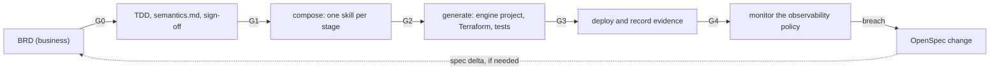
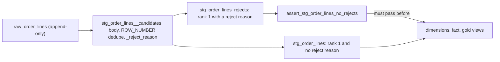

# Data Product Framework user guide

This guide shows you how to build a data product with the Data Product Framework (DPF). You
start from business requirements and end with a tested, monitored product on Google Cloud.
One worked example, `sales_performance`, goes through every stage with real command output.

> [!NOTE]
> **Template or example?** This guide links to the worked examples in `products/`,
> `examples/`, `openspec/specs/products/` and `tests/golden/`. They exist only in the
> framework repository. `dpf init` copies this guide into a new workspace but not the
> examples, so those links do not work there. Read the examples in the framework repository.

> [!IMPORTANT]
> All output in this guide is real. It was captured with `python -m dpf` (dpf 0.3.0) from the
> repository root, which runs the same code as the `dpf` command. Long output is trimmed with
> `…`. Your build digests will differ from the ones shown, because a digest changes when any
> input changes. Some failures were caused on purpose in a scratch copy of the workspace. The
> text says so each time.

## Contents

1. [What DPF is and is not](#1-what-dpf-is-and-is-not)
2. [Key terms](#2-key-terms)
3. [Install DPF and run the first check](#3-install-dpf-and-run-the-first-check)
4. [Find your way around the repository](#4-find-your-way-around-the-repository)
5. [Take one product from BRD to monitoring](#5-take-one-product-from-brd-to-monitoring)
6. [Write the product documents](#6-write-the-product-documents)
7. [Understand what the generators produce](#7-understand-what-the-generators-produce)
8. [Test the build and record evidence](#8-test-the-build-and-record-evidence)
9. [Monitor and operate the product](#9-monitor-and-operate-the-product)
10. [Change a product with OpenSpec](#10-change-a-product-with-openspec)
11. [Keep the framework itself correct](#11-keep-the-framework-itself-correct)
12. [Extend the framework](#12-extend-the-framework)
13. [CLI reference](#13-cli-reference)
14. [Fix common failures](#14-fix-common-failures)
15. [Limitations and roadmap](#15-limitations-and-roadmap)

## 1. What DPF is and is not

DPF builds data products from specs. You write what the business needs and how you will meet
it. A small Python CLI, `dpf`, checks each stage with a gate. It also generates everything that
can be generated: the Dataform or dbt project, the Terraform module, the tests and the
documents.

The **data product** is the unit of work. One BRD scopes it, one TDD designs it, one manifest
resolves it, and every generated file traces back to one of its requirements.



| Gate | Stage | Passes when | Command |
|---|---|---|---|
| G0 | Define | The BRD answers every rubric question, is approved, and uses no modelling or technology words | `dpf brd validate <product>` |
| G1 | Design | The TDD and manifest resolve every requirement. Methodology, grain and history are justified. The business signature matches the current semantics | `dpf check <product> --gate G1` |
| G2 | Compose | Each pipeline stage selects exactly one skill and an implemented engine adapter. Every business scenario (AX) has an acceptance test (AT) | `dpf check <product> --gate G2` |
| G3 | Build | Generation is deterministic and matches the reviewed golden copy. Every requirement reaches a decision, a generated file and a test | `dpf check <product> --gate G3` |
| G4 | Test | Every test case has passing evidence for the current build digest | `dpf check <product> --gate G4` |
| – | Monitor | The deployed product meets its observability policy. A breach can open an OpenSpec change | `dpf monitor <product>` |

Gates are cumulative: `--gate G3` runs G0 to G3. At G3 and G4, `dpf check` also runs
`dpf validate` and `dpf lint` first.

### Who uses DPF

| Role | Writes or runs | Main files |
|---|---|---|
| Business owner or analyst | The BRD in business language. Reads and signs `semantics.md` | `brd/spec.md`, `brd/brd.yaml`, `tdd/semantics.md` |
| Data engineer or architect | The TDD, the manifest, SQL bodies and the acceptance mapping. Runs the gates | `tdd/spec.md`, `product.yaml`, `sql/*.sql`, `acceptance.yaml` |
| Platform team | Methodology packs, engine adapters, skills, contracts and the registry | `methodologies/`, `engines/`, `skills/`, `contracts/`, `registry/` |
| Operator | Deploys, records evidence, responds to alerts | the product runbook, `evidence/`, `dpf monitor` |
| Coding agent | Follows the same rules as people | [`openspec/AGENTS.md`](../openspec/AGENTS.md) |

### What DPF does not do

- **It does not run your pipeline.** Dataform or dbt builds the tables. Dataform workflow
  configurations, or a scheduler you choose for dbt, run them.
- **It does not deploy.** It writes a Terraform module. You run `terraform apply`.
- **It does not touch BigQuery in G0 to G3.** These gates run offline, with no BigQuery dry
  run. Only `dpf test run --live` and `dpf monitor` without `--evidence` call BigQuery.
- **It is not a catalog.** It writes `catalog-registration.json`. You register the product in
  Knowledge Catalog through the MCP server or the API.
- **It never invents evidence.** G4 stays red until a deployed run records results for the
  current build.
- **It does not force a methodology.** `direct` is the default. Kimball is optional, and you
  must justify it with BRD signals and an ADR.

## 2. Key terms

| Term | Meaning | Where |
|---|---|---|
| Data product | The unit of work: one BRD, one TDD, one manifest, one set of generated files | `products/<id>/` |
| BRD | Business requirements document. Requirements (`R-n`) and acceptance scenarios (`AX-n`) in business language, plus structured rubric answers | `openspec/specs/products/<domain>/<product>/brd/` |
| Rubric | The questions every BRD must answer, in groups A to K | `registry/brd-rubric.yaml` |
| TDD | Technical design document. Decisions (`D-n`), each citing the requirements it satisfies | `.../tdd/spec.md` |
| `semantics.md` | The design told back in business language: what the figures mean, how history behaves, timing | `.../tdd/semantics.md` |
| Sign-off | The business owner's signature on `semantics.md`, bound to the semantic digest | `.../tdd/signoff.yaml` |
| Semantic digest | A sha256 over `semantics.md` and each model's grain and history. Changing either voids the signature | `signoff.yaml` |
| Manifest | The resolved design: sources, models, grain, history, quality, ports, schedules, monitoring, governance | `products/<id>/product.yaml` |
| Acceptance mapping | Maps each `AX-n` to an acceptance test (`AT-n`): automated SQL, a static check or an attestation | `products/<id>/acceptance.yaml` |
| Grain | What one row means (grain statement) and the columns that make a row unique (grain columns) | manifest, TDD |
| History semantics | How attribute changes behave: `current_only` (latest values) or `point_in_time` (values at the event date) | manifest |
| Methodology pack | A modelling style with roles, rules and skills: `direct` (default) or `kimball` | `methodologies/` |
| Engine adapter | Declares which roles an engine implements. Dataform and dbt are implemented; Dataflow and Spark are planned | `engines/` |
| Skill | One unit of work for one pipeline stage, selected by its `selects_when` conditions | `skills/`, `methodologies/*/skills/` |
| Tool tier | How a skill does its work, from 1 (managed remote MCP server) to 5 (bespoke code, needs an ADR) | `registry/mcp_servers.yaml` |
| Contract | A JSON Schema for one hand-off, for example `product-manifest.v1`. There are 22 | `contracts/` |
| Registry | Platform defaults and shared catalogues: source systems, glossary, entities, conformed dimensions, MCP servers | `registry/` |
| Build digest | A sha256 over every input to the build. Evidence counts only for the digest it was recorded against | `MANIFEST.json` |
| Golden copy | The reviewed, committed copy of the generated files | `tests/golden/<product>/` |
| Trace matrix | Requirement → decision → element → artefact → test → evidence | `generated/<product>/trace.md` |
| Evidence | A `test-evidence.v1` file with test results for one build digest | `evidence/<product>/*.json` |
| Attestation | A recorded human confirmation for a test that SQL cannot check | `dpf test attest` |
| Static check | A check that `dpf` runs on the manifest and the generated files, for example `freshness_policy` | `acceptance.yaml` |
| Quarantine and reject gate | Staging moves rows that fail a blocking quality rule (`QR-n`) to a `_rejects` view. A reject-gate assertion then stops every downstream refresh | generated staging |
| Change | An OpenSpec change folder: proposal, delta specs, design, verification, operations, tasks | `openspec/changes/<id>/` |

## 3. Install DPF and run the first check

### Requirements

| You need | Version | For |
|---|---|---|
| Python | 3.10 or later | `dpf` itself |
| `google-cloud-bigquery` | 3.20 or later (the `[gcp]` extra) | `dpf test run --live`, `dpf monitor` without `--evidence`, the example extractor |
| OpenSpec CLI | `@fission-ai/openspec@1.14.0` (CI pin) | `openspec validate`, new changes |
| Terraform | 1.5 or later (CI uses 1.9.8) | applying the generated module |
| Dataform CLI | `@dataform/cli@3.0.71` through `npx` (CI pin) | compiling or running the Dataform project |
| dbt | `dbt-core` 1.12.5 and `dbt-bigquery` 1.12.1 (`requirements/dbt.txt`) | the dbt rendering only |

### Install

```bash
python3 -m venv .venv && . .venv/bin/activate
pip install -e '.[dev]'        # dpf plus pytest; loose version pins
pip install -e '.[dev,gcp]'    # also google-cloud-bigquery, for live tests and monitoring
make install                   # or: the hash-locked versions that CI uses
```

`make install` runs `pip install --require-hashes -r requirements/dev.txt` and then
`pip install --no-deps -e .`. `make lock` re-pins `requirements/dev.txt` and
`requirements/dbt.txt` with `uv pip compile`. Without an install, run `python -m dpf` from the
repository root or `tools/dpf` from a checkout.

`dpf` finds the workspace by walking up from the current folder to the first folder that has
both `contracts/` and `openspec/`. Use `--root <path>` to point at another workspace.

### Run the first check

```text
$ dpf check --all --gate G3 --quiet

all checks passed (0 warning(s))
```

This runs framework validation, lint and G0 to G3 for both examples. Without `--quiet` it
prints one line per check, about 200 lines.
[Section 5](#5-take-one-product-from-brd-to-monitoring) runs every other command on one
example.

### Expect G4 to fail on the examples

```text
$ dpf check sales_performance --gate G4 --quiet

G4 · evidence — sales_performance
FAIL | grain:stg_customers (automated): no evidence for build sha256:36ae98b93fb1… (`dpf test run sales_performance --live`)
…
FAIL | acceptance:AT-8 (attestation): no evidence for build sha256:36ae98b93fb1… (`dpf test attest sales_performance AT-8 --by <name> --role merchandising`)
FAIL | acceptance:AT-9 (automated): no evidence for build sha256:36ae98b93fb1… (`dpf test run sales_performance --live`)

38 failure(s), 0 warning(s)
```

This is the honest state. Nobody has deployed the examples, so no evidence exists.
`customer_orders` fails G4 with 14 failures for the same reason. Each failure names the
command that would produce the missing evidence.

### Read a report

Each line starts with `ok`, `warn` or `FAIL`. A line with no label is information, for
example a file that was written. A warning keeps the exit code at 0. Exit codes: `0` pass,
`1` at least one failure, `2` usage error. `--quiet` prints only failures and warnings.
`--json` prints a machine-readable report (see [CLI reference](#13-cli-reference)).

## 4. Find your way around the repository

```text
openspec/       project context, the data-product change schema, platform and product specs, changes
contracts/      22 JSON Schemas, one for each hand-off
dpf/            the CLI: gates, compose, generate/, trace, testing, monitor, lint, evals
methodologies/  modelling packs direct (default) and kimball: roles, rules, skills
engines/        engine adapters: dataform and dbt implemented; dataflow and spark planned
skills/         platform skills (Agent Skills format plus dpf metadata)
registry/       platform defaults, MCP servers, BRD rubric and vocabulary, empty catalogues
adr/            platform decision records ADR-001 to ADR-015
products/       example manifests, SQL bodies, acceptance mappings, product ADRs
examples/       example registry overlay, extractor, seed fixtures, Terraform wrapper, runbook
requirements/   hash-locked dependency pins (dev, dbt)
generated/      build output (gitignored, regenerate at will)
evidence/       test evidence per product (written by dpf test)
tests/          unit and contract tests, golden copies, behavioural evals
docs/           this guide, the design plan, the method diagram, connectivity notes
```

### Template and example material

| Template: copied by `dpf init` | Example: not copied |
|---|---|
| `openspec/` config, schema, project context, `specs/platform/`, `changes/README.md` | `openspec/specs/products/*` |
| `contracts/`, `methodologies/`, `engines/`, `skills/`, `registry/`, `adr/` | `products/*`, `examples/` |
| `dpf/`, `tools/dpf`, `pyproject.toml`, `requirements/`, `Makefile`, `.gitignore`, CI | `generated/`, `evidence/`, `tests/golden/*` |
| `tests/contracts`, the eval and golden READMEs, `docs/user-guide.md` | `docs/presentation/`, `docs/index.html`, `docs/data-product-framework-plan.md` |

### The registry

| File | Holds | In a new workspace |
|---|---|---|
| `platform-defaults.yaml` | `region`, `gcp_project`, `billing_project`, `business_timezone`, the default methodology (`direct`) and engine (`dataform`) per layer, naming patterns, gate settings | populated; set the project, region and timezone for your platform |
| `mcp_servers.yaml` | the tool catalogue by tier, and needs that have no MCP option yet | populated |
| `brd-rubric.yaml` | rubric groups A to K, their questions, and how each answer drives a design decision | populated |
| `brd-vocabulary.yaml` | modelling and technology words that fail G0 | populated |
| `source_systems.yaml`, `glossary.yaml`, `entities.yaml`, `conformance.yaml` | your systems, agreed terms, entities and conformed dimensions | empty lists with commented templates |

> [!NOTE]
> `platform-defaults.yaml` ships with `business_timezone: Australia/Perth` and
> `region: us-central1`, which match the examples. Change them for your platform.

The examples do not add their source systems or glossary to `registry/`. Instead each
manifest sets `registry_overlay: examples/registry`. `dpf` reads `registry/*.yaml` first and
then the overlay file with the same name. Lists merge by their id field and other keys are
replaced. `registry/` itself does not change.

### Start a new workspace

The target path below is shortened to `../my-workspace`:

```text
$ dpf init ../my-workspace

init — ../my-workspace
  ok | openspec/config.yaml
  ok | openspec/schemas
…
  ok | requirements
  ok | Makefile
…
  ok | docs/user-guide.md
     | not copied (example material): openspec/specs/products/*, products/*, examples/, generated/, evidence/, tests/golden/*, docs/presentation/, docs/index.html, docs/data-product-framework-plan.md

all checks passed (0 warning(s))
```

The target folder must be empty. Otherwise `dpf init` fails with
`../my-workspace exists and is not empty`. A new workspace passes
`dpf check --all --gate G3` at once, because it has no products yet. Its README lists the
first steps. Set `gcp_project`, `region` and `business_timezone` in
`registry/platform-defaults.yaml` and add your source systems and glossary terms. Then follow
[section 5](#5-take-one-product-from-brd-to-monitoring) and [Add a product](#add-a-product).

## 5. Take one product from BRD to monitoring

This section follows `sales_performance` through every gate. `customer_orders` is the smaller
example: one object-store source, `direct` only, and current state only.

### 5.1 The example at a glance

| Item | `sales_performance` |
|---|---|
| BRD | BRD-SALES-002 @ 1.2.0: 13 requirements, 14 acceptance scenarios |
| Source | on-premises Oracle `ora_local`, read hourly by an outbound watermark extractor (ADR-015, tool tier 5) |
| Silver layer | `kimball`: `dim_customer` and `dim_product` (Type 2), `dim_date`, `fct_order_line` |
| Gold layer | `direct`: `sales_performance_monthly` (table), `sales_order_line_detail` (view), `sales_performance_partner_extract` (table in the share dataset) |
| Bad data | QR-1 (no customer) and QR-2 (negative quantity) quarantine rows and stop publication (R-11) |
| Protection | PT-1: tag `pii_contact` on customer email and phone, null mask for analysts (R-12) |
| Sharing | BigQuery sharing listing `sales_performance_monthly_extract` for the partner (R-13) |
| Schedules | `hourly` at `10 * * * *` and `monthly` at `0 7 2 * *`, Australia/Perth |
| Service levels | OB-1: gold at most 90 minutes old, Monday to Friday 08:00 to 18:00 Perth time. OB-2: partner extract at most 32 days old. OB-3: 16,000 to 64,000 order lines per day |
| Files | [BRD](../openspec/specs/products/sales/sales-performance/brd/spec.md), [BRD answers](../openspec/specs/products/sales/sales-performance/brd/brd.yaml), [TDD](../openspec/specs/products/sales/sales-performance/tdd/spec.md), [semantics.md](../openspec/specs/products/sales/sales-performance/tdd/semantics.md), [signoff.yaml](../openspec/specs/products/sales/sales-performance/tdd/signoff.yaml), [product.yaml](../products/sales_performance/product.yaml), [sql/](../products/sales_performance/sql/), [acceptance.yaml](../products/sales_performance/acceptance.yaml), [product ADRs](../products/sales_performance/adr/), [RUNBOOK.md](../examples/sales_performance/RUNBOOK.md) |

### 5.2 G0: check that the BRD is complete

```text
$ dpf brd validate sales_performance

G0 · BRD completeness — sales_performance
  ok | brd.yaml conforms to brd.v1
  ok | spec and answers agree on id BRD-SALES-002
  ok | spec and answers agree on version 1.2.0
  ok | 13 requirements, 14 acceptance scenarios
  ok | group A (Purpose and consumers) answered
…
  ok | group K (Scope) answered
  ok | no modelling vocabulary in the BRD
  ok | no technology choices in the BRD
  ok | every figure and attribute is defined in the glossary
  ok | BRD is approved by the business owner

all checks passed (0 warning(s))
```

`dpf brd validate` also writes `generated/sales_performance/gaps.md`, which here says "No
gaps." Group J (acceptance examples) has no line of its own. It is the check that every
requirement has a scenario.

**Failure: design words in the BRD.** In a scratch copy, one requirement was changed to say
"from a fact table with a Type 2 SCD on customer":

```text
$ dpf check sales_performance --gate G0
…
FAIL | BRD contains modelling vocabulary that belongs in the TDD: scd, fact table
  ok | no technology choices in the BRD
…
1 failure(s), 0 warning(s)
```

**Failure: an unanswered question.** In a scratch copy, `level_of_detail` was removed from the
`customer_orders` answers:

```text
$ dpf brd validate customer_orders

G0 · BRD completeness — customer_orders
FAIL | brd.yaml does not conform to brd.v1: (root): 'level_of_detail' is a required property
…
FAIL | group C (Level of detail) unanswered: level_of_detail.drill_to, level_of_detail.distinct_by
…
2 failure(s), 0 warning(s)
```

The gap register then holds the question for the business owner:

```markdown
| Group | Field | Question | Context |
|---|---|---|---|
| C | level_of_detail.drill_to, level_of_detail.distinct_by | What is the finest level of detail you need to drill down to, and what makes each one distinct? | Level of detail |
```

### 5.3 G1: check that the design resolves the BRD

**Step 1. See what each business answer drives.**

```text
$ dpf tdd resolve sales_performance
# Resolution guide — BRD-SALES-002 → TDD-SALES-002
…
| BRD answer | Value | Derives |
|---|---|---|
| `level_of_detail.drill_to` | an individual line on a customer order | grain statement |
| `level_of_detail.distinct_by` | each line on each order counts once, at its latest amended values | grain columns and the uniqueness check |
…
**Methodology recommendation:** `kimball`

- AG-1: figures must agree with finance on net sales / revenue for a period
- AG-2: figures must agree with merchandising on product category definitions
- HB-1: past figures keep the customer segment that applied at the time
…
```

The recommendation is `kimball` because the figures must agree with two other teams (AG-1,
AG-2) and past figures must keep old values (HB-1 to HB-3). Without these signals, `direct`
would be correct and cheaper.

**Step 2. Write the design.** Write the TDD, `semantics.md`, `product.yaml`, the SQL bodies and
`acceptance.yaml` ([section 6](#6-write-the-product-documents)). The departure from `direct`
needs a product ADR whose front matter says `decides: methodology` (here ADR-SALES-002-01).

**Step 3. Get the business signature.** The business owner reads `semantics.md`, and you
record the signature. Shown in a scratch copy, because it rewrites `signoff.yaml`:

```text
$ dpf signoff sales_performance --by "Jane Doe" --role business_owner

sign-off — sales_performance
  ok | signed BRD-SALES-002@1.2.0 semantics by Jane Doe (business_owner); covers AX-1, AX-2, AX-3, AX-4, AX-5, AX-6, AX-7, AX-8, AX-9, AX-10, AX-11, AX-12, AX-13, AX-14; digest sha256:aa36075261e6…

all checks passed (0 warning(s))
```

**Step 4. Run G1.**

```text
$ dpf check sales_performance --gate G1
…
  ok | D-3: fct_order_line grain matches the TDD
…
  ok | external readers are served by a sharing listing
  ok | restricted attributes are protected by policy tags
  ok | access grants are declared
  ok | bad data stops publication (blocking quality gate)
  ok | restatement window of 90 days is declared
  ok | departure from the 'direct' default is recorded (ADR-SALES-002-01)
…
G1 · design rules — sales_performance
  ok | direct/grain-declared-and-asserted: 10 model(s) comply
…
G1 · semantics sign-off — sales_performance
  ok | signoff.yaml conforms to signoff.v1
  ok | signature matches current semantics (sha256:aa36075261e6…)
  ok | signed against BRD-SALES-002@1.2.0
  ok | signature covers all 14 acceptance scenarios
```

G1 checks, in order: currency with the BRD version, decisions and grain, orphan elements,
roles, output ports, references, BRD derivations (sharing, policy tags, blocking gate,
restatement window), methodology, history, capture mode, staging deduplication,
observability, methodology envy, pack rules, and the sign-off.

**Failure: the manifest grain drifts from the TDD.** In a scratch copy, the grain of
`fct_order_line` was changed from `[order_id, order_line_no]` to `[order_id]`:

```text
$ dpf check sales_performance --gate G1
…
FAIL | D-3: TDD grain (order_id, order_line_no) differs from manifest grain (order_id) for fct_order_line
…
FAIL | signature is invalid: semantics.md or a model's grain/history changed since sign-off
…
2 failure(s), 0 warning(s)
```

One edit caused two failures. The grain no longer matches decision D-3, and the grain is part
of the semantic digest, so the signature is void. A grain change is a business change: it
needs a BRD and TDD delta and a new signature.

### 5.4 G2: compose the pipeline

```text
$ dpf compose sales_performance

G2 · compose pipeline — sales_performance
  ok | composed 21 nodes and 45 typed edges across 13 stages
     | tier 5 (bespoke code): extract-rdbms-watermark (bespoke-code)

G2 · acceptance mapping — sales_performance
  ok | every business scenario is verified by an acceptance test (14 AX, 14 AT)
     | acceptance tests: 2 attestation, 7 automated, 5 static

all checks passed (0 warning(s))
```

Compose walks 13 stages in order: `extract`, `land`, `stage`, `integrate`, `consume`, `govern`,
`test`, `assemble`, `render`, `orchestrate`, `publish`, `register`, `monitor`. Each source and
model must match exactly one skill. The engine adapter must implement the model's role, and
the pack must list that engine for the role. Compose writes `dag.json` and `dag.md`, a Mermaid
graph whose nodes are skills and whose edges name the contract they carry.

### 5.5 G3: generate the files and trace every requirement

```text
$ dpf generate sales_performance

G3 · generate artefacts — sales_performance
  ok | rendered 93 files (36 assertions, 43 test cases); build digest sha256:36ae98b93fb1…
     | wrote generated/sales_performance/

all checks passed (0 warning(s))
```

`dpf check --gate G3` adds two checks. It builds twice and reports
`generation is deterministic (two runs are byte-identical)`, and it compares the build with
the golden copy: `matches golden copy tests/golden/sales_performance/ (93 files)`.

Then it traces. Every requirement must reach a TDD decision, a generated file and a test.
Generated files are linked to requirements by their `dpf:` marker lines.

```text
$ dpf trace sales_performance --print

G3 · traceability — sales_performance
  ok | trace matrix conforms to trace-matrix.v1
  ok | every requirement has a TDD decision (13)
  ok | every requirement reaches a generated artefact (13)
  ok | every requirement is verified by at least one test (13)
     | evidence by requirement: 12 missing, 1 passed (evaluated at G4)
     | wrote generated/sales_performance/trace.md and trace.json
…
| Requirement | Scenarios | Decisions | Elements | Artefacts | Tests | Evidence |
|---|---|---|---|---|---|---|
| R-1 Segment performance | AX-1 | D-2, D-7, D-15 | 3 | 4 | 5 | missing |
…
| R-10 Hourly availability during the working day | AX-11 | D-10, D-11, D-18 | 3 | 3 | 1 | passed |
…
```

After the table, `trace.md` has one section per requirement that lists its decisions, design
elements, artefacts, tests and evidence. R-10 already shows "passed". Its only test is the
static check AT-11, which `dpf` can evaluate without a deployment.

**Failure: the build no longer matches the golden copy.** In a scratch copy, one comment line
was added to `sql/sales_performance_monthly.sql`. G4 includes G3, so it shows the problem:

```text
$ dpf check sales_performance --gate G4
…
  ok | rendered 93 files (36 assertions, 43 test cases); build digest sha256:511226590c5a…
  ok | generation is deterministic (two runs are byte-identical)
FAIL | differs from golden copy: differs README.md; differs dataform/definitions/gold/sales_performance_monthly.sqlx; differs test-spec.json; differs MANIFEST.json
…
```

The SQL body changed one generated file, and the new build digest changed three more. Review
the diff. If it is what you intended, accept it with
`dpf generate sales_performance --update-golden` and commit the golden copy with the change.

### 5.6 Deploy the product

`dpf` does not deploy. These steps come from the
[runbook](../examples/sales_performance/RUNBOOK.md). They need a Google Cloud project and were
not run for this guide.

```bash
dpf generate sales_performance                     # the module and the Dataform project
cd examples/sales_performance/terraform            # the wrapper root module
cp terraform.tfvars.example terraform.tfvars       # groups, Dataform repository, alert channel
terraform init && terraform apply                  # before the first extract
```

1. Push `generated/sales_performance/dataform/` to the default branch of the Dataform
   repository named in the Terraform variable `dataform_repository`.
2. Load data: the seed fixtures in phases, or the extractor against the real Oracle source.
3. Build. The workflow configurations run the `hourly` and `monthly` tags. By hand, run
   `npx @dataform/cli@3 run` in `generated/sales_performance/dataform`.

Load the seed in phases with a build between them (`generate_seed.py --phase 1 --load`, build,
`--phase 2 --load`, build). A Type 2 dimension records history as changes arrive. If you load
both states at once, staging keeps only the latest one and the earlier version is lost. Load
phase 3 (a line with no customer) after you record evidence: it proves that the reject gate
stops publication.

### 5.7 G4: record evidence for the current build

```text
$ dpf test plan sales_performance
Test specification — sales_performance (43 cases, build sha256:36ae98b93fb1…)

case                                                       method      sev   satisfies / verifies
grain:stg_customers                                        automated   block R-4
…
reject_gate:stg_order_lines                                automated   block R-11
…
integrity:fct_order_line:dim_customer:late_arrival         automated   warn  R-2,R-3,R-7,R-8,R-9
…
acceptance:AT-5                                            attestation block R-5 / AX-5
…
acceptance:AT-14                                           static      block R-13 / AX-14
```

Without `--live`, `dpf test run` evaluates only the five static cases (AT-10 to AT-14) and
writes no evidence. On a deployed and seeded build, run the SQL cases, record the two
attestations, and check:

```bash
dpf test run sales_performance --live --env test
dpf test attest sales_performance AT-5 --by "<name>" --role finance
dpf test attest sales_performance AT-8 --by "<name>" --role merchandising
dpf check sales_performance --gate G4
```

Today, with no deployment, G4 passes only the five static cases and ends with
`evidence: 38 missing, 5 passed` and `38 failure(s), 0 warning(s)`.

**Attestation, step by step (scratch copy).** The role must match `attested_by_role`:

```text
$ dpf test attest sales_performance AT-5 --by "Jane Doe" --role sales
…
FAIL | AT-5 must be attested by role 'finance', not 'sales'

$ dpf test attest sales_performance AT-5 --by "Jane Doe" --role finance --note "Reconciled March net sales to the GL"

attest — sales_performance AT-5
  ok | recorded attestation of AT-5 by Jane Doe (finance) for build sha256:36ae98b93fb1…

all checks passed (0 warning(s))
```

This wrote `evidence/sales_performance/attest-AT-5-20261005T034423Z.json` (contract
`test-evidence.v1`), shown here with the result on one line:

```json
{
  "product_id": "sales_performance",
  "artefact_digest": "sha256:36ae98b93fb145497a614c67a8e4864cf08a3688f1c683d88cde0f5b6a444371",
  "run_id": "attest-AT-5-20261005T034423Z",
  "environment": "test",
  "recorded_at": "2026-10-05T03:44:23Z",
  "results": [
    {"test_id": "acceptance:AT-5", "status": "passed", "attested_by": "Jane Doe (finance)", …}
  ]
}
```

G4 then reports `ok | acceptance:AT-5 (attestation) passed` and
`evidence: 37 missing, 6 passed`.

**Failure: evidence for an older build.** After the attestation, the comment line from
[section 5.5](#55-g3-generate-the-files-and-trace-every-requirement) was added to the SQL body
in the same scratch copy. The build digest changed, so the attestation no longer counts:

```text
$ dpf check sales_performance --gate G4
…
FAIL | acceptance:AT-5 (attestation): evidence is for an older build digest; re-run against the current build
…
     | evidence: 37 missing, 5 passed, 1 stale

39 failure(s), 0 warning(s)
```

This is deliberate. Evidence proves that one exact build works. A change to any input makes a
new build that needs new evidence.

### 5.8 Monitor the deployed product

`dpf monitor` checks run evidence against the observability policy in the manifest. The eval
fixture [run-evidence.json](../tests/evals/monitor-breach/run-evidence.json) describes a run
observed at 03:00 UTC on Wednesday 7 October 2026, which is 11:00 in Perth:

```text
$ dpf monitor sales_performance --evidence tests/evals/monitor-breach/run-evidence.json

monitor — sales_performance
  ok | OB-2: sales_performance_partner_extract is 7680 minutes old (limit 46080)
  ok | OB-3: fct_order_line holds 41250 rows (expected 16000–64000)
FAIL | freshness OB-1: sales_performance_monthly is 150 minutes old (limit 90) [R-10]

1 failure(s), 0 warning(s)
```

With `--open-change`, the breach becomes an OpenSpec change (scratch copy):

```text
$ dpf monitor sales_performance --evidence tests/evals/monitor-breach/run-evidence.json --open-change
…
FAIL | freshness OB-1: sales_performance_monthly is 150 minutes old (limit 90) [R-10]
     | opened change openspec/changes/monitor-sales-performance-freshness-20261007-0300/ (validate with `openspec validate monitor-sales-performance-freshness-20261007-0300 --strict`)
```

The folder holds `.openspec.yaml`, `proposal.md`, `design.md`, `verification.md`,
`operations.md` and `tasks.md`. The proposal quotes the breach (OB-1, 150 min against a
90 min limit, R-10) and links the runbook section `#freshness-or-volume-breach`. The
`.openspec.yaml` sets `skip_specs: true`. An operational fix has no spec delta until the
investigation shows that a requirement or decision must change.

## 6. Write the product documents

| File | Written by | Checked at |
|---|---|---|
| `openspec/specs/products/<domain>/<product>/brd/spec.md` and `brd.yaml` | business analyst | G0 |
| `.../tdd/spec.md` | data engineer | G1 |
| `.../tdd/semantics.md` and `signoff.yaml` | data engineer; signed by the business owner | G1 |
| `products/<id>/product.yaml` | data engineer | validate, G1, G2 |
| `products/<id>/sql/*.sql` | data engineer | G1 rules, G3 |
| `products/<id>/acceptance.yaml` | data engineer with the business | G2, G4 |

The manifest links the two specs with `specs.brd` and `specs.tdd`, relative to
`openspec/specs/`.

### 6.1 The BRD

`spec.md` holds requirements and scenarios. `brd.yaml` holds the structured rubric answers.
Neither may use modelling words (fact table, SCD, grain and similar) or technology choices
such as products or cloud regions. The word lists are in `registry/brd-vocabulary.yaml`.

```markdown
**BRD:** BRD-SALES-002 · **Version:** 1.2.0 · **Status:** approved · **Owner:** Sales Operations · **Steward:** Data Analytics

### Requirement: Segment performance
**ID:** R-1

Users SHALL be able to see net sales by customer segment, product category and region, for
any period.

#### Scenario: Quarterly segment review
**ID:** AX-1
- **GIVEN** sales recorded in two different quarters
- **WHEN** a manager asks which customer segments grew net sales between them
- **THEN** they get net sales per segment for both quarters, worked out the same way
```

G0 checks that:

- each requirement has an `**ID:** R-n` line, uses SHALL or MUST, and has at least one scenario
  with an `**ID:** AX-n` line, a WHEN step and a THEN step
- the id and version agree between `spec.md` and `brd.yaml`, and `product_id` matches
- every rubric group is answered, and `status` is `approved` (not `draft`, `in_review` or
  `superseded`)
- each open question has an owner, a due date and a recorded assumption (ADR-009). A BRD that
  goes ahead on an assumption gets a warning, and the product stays provisional

Glossary coverage is a warning only.

| Group | Topic | Question to the business |
|---|---|---|
| A | Purpose and consumers | What questions must this answer, who needs the answers, and what decision do they support? |
| B | Required outputs | What exactly do you want to see, with which figures and slices? |
| C | Level of detail | What is the finest level of detail you need to drill down to, and what makes each one distinct? |
| D | History behaviour | If a value such as a segment or category changes, should past figures follow it or stay as they were? |
| E | Timeliness and volume | How fresh does this need to be, and what decision depends on that freshness? |
| F | Exceptions and edge cases | What happens with cancellations, refunds, amendments or late corrections? |
| G | Fitness and bad data | What would make a record unusable to you, and should bad data stop publication? |
| H | Sources believed | Which systems do you believe hold this data, and which is authoritative? |
| I | Protection and access | How sensitive is this, who may see it, and is anything restricted? |
| J | Acceptance examples | Can you give a worked example of a correct answer for this requirement? |
| K | Scope | What is explicitly out of scope? |

`brd.yaml` also answers four questions that drive design choices: agreement with other teams
(`agreement_with_other_teams`), totalling (`totalling`), protection (`protection`) and external
readers (`external_readers`). `dpf tdd resolve` shows how each answer maps to a decision.

### 6.2 The TDD

Each design decision is a `### Requirement:` block. Its first line holds metadata in the form
`**Key:** value · **Key:** value`. Keys are not case-sensitive.

```markdown
**TDD:** TDD-SALES-002 · **Satisfies:** BRD-SALES-002@1.2.0 · **Version:** 1.2.0 · **Owner:** Data Analytics

### Requirement: Order line grain
**Decision:** D-3 · **Satisfies:** R-2, R-3 · **Model:** fct_order_line · **Grain:** order_id, order_line_no

`fct_order_line` SHALL hold one row per order line at its latest amended values. A uniqueness
check on the grain columns SHALL block publication when duplicates exist.

#### Scenario: Duplicate order line
- **GIVEN** two rows for the same order line
- **WHEN** the fact is built
- **THEN** the grain check SHALL fail and gold SHALL NOT be refreshed
```

| Key | Example | What G1 checks |
|---|---|---|
| `Satisfies` (Purpose line) | `BRD-SALES-002@1.2.0` | equals the current BRD id and version; otherwise the TDD is stale |
| `Decision` | `D-3` | unique; the trace matrix links requirements to it |
| `Satisfies` | `R-2, R-3` | names existing requirements; every requirement needs at least one decision |
| `Model`, `Grain` | `fct_order_line`, `order_id, order_line_no` | the grain equals the model's `grain_columns` |
| `Layer`, `Methodology` | `silver`, `kimball` | equal `layers.<layer>.methodology` in the manifest |
| `ADR` | `ADR-SALES-002-01` | the ADR exists |

Steps may use `GIVEN`, `WHEN`, `THEN`, `AND` and `BECAUSE`. Every consumption model's grain must
be decided in the TDD.

### 6.3 semantics.md and the sign-off

`semantics.md` tells the business what they will receive, in their own words: what the figures
mean, how history behaves, what is included and excluded, timing, and known limits.

```markdown
## How history behaves

- Sales stay with the **customer segment and region that applied on the date of the sale**.
  If a customer is reclassified in June, their March sales still report under the old segment.
```

`dpf signoff <product> --by <name> --role <role> [--date YYYY-MM-DD] [--note <text>]` writes
`signoff.yaml`:

```yaml
product_id: sales_performance
signed_by: Sales Operations (example)
role: business_owner
date: '2026-10-05'
brd: BRD-SALES-002@1.2.0
tdd: TDD-SALES-002
covers:
- AX-1
# … AX-2 to AX-14
semantic_digest: sha256:aa36075261e649fa985d186f36fbd715f5886d25f47919a25ccfefee5c901a92
```

The semantic digest covers the normalised text of `semantics.md` and, for each model, its name,
grain statement, grain columns and history semantics. The signature is void after:

- any edit to `semantics.md`
- a change to a model's grain or history semantics, or a new or renamed model
- a new BRD version, because the signature names the version it was given against

SQL bodies, schedules, partitioning and the engine are not in the semantic digest. Changing
them needs no new signature.

> [!WARNING]
> The example signatures are by "Sales Operations (example)". They are not real approvals.

### 6.4 The manifest: product.yaml

Every element cites the requirement it satisfies (`brd_requirement_id`) or the platform
capability that requires it (`implements`). G1 fails an element that cites neither.

| Section | Declares | Checked at |
|---|---|---|
| `product_id`, `version`, `status`, `owner`, `steward`, `domain`, `classification` | identity and ownership. `status` is `draft`, `provisional`, `published` or `deprecated` | validate |
| `registry_overlay` | an optional registry overlay folder | – |
| `specs`, `brd_id`, `tdd_id`, `satisfies`, `adrs`, `acceptance` | links to the specs. `satisfies` must equal the current BRD id and version | G1 |
| `deployment` | `gcp_project`, `region`, and one dataset per purpose: `raw`, `staging`, `silver`, `gold`, `share`, `assertions`, `control` | G3 |
| `sources` | `system_id`, `engine`, `capture_mode`, watermark settings, `schedule`, `entities` | G1, G2 |
| `layers.<layer>` | `methodology`, `engine`, `storage`, `models` for `raw`, `staging`, `silver`, `gold` | G1, G2 |
| `output_ports` | `model`, `type`, `access` (`dataset_grant`, `authorized_view`, `sharing_listing`), `consumers`, `sharing` | G1 |
| `quality` | `gate_behaviour` (`block` or `warn`) and rules `QR-n` with `type`, `column`, `severity`, `on_fail` | G1, G3 |
| `orchestration` | `engine`, `timezone`, and `schedules` with `id` and `cron` | G2, G3 |
| `observability` | `freshness`, `volume`, `schema_drift`, `quality_scans`, `alerting`, `slo` | G1, monitor |
| `governance` | catalog registration, `access` grants, `policy_tags` with `masking` (`always_null`, `sha256`, `default_masking_value`) | G1, static checks |

| Model key | Meaning |
|---|---|
| `name`, `role` | the model and its role in the layer's pack (or `staging`) |
| `grain_statement`, `grain_columns` | what one row means, and the columns that make it unique |
| `natural_key`, `dedupe_order` | staging: the key to deduplicate on, and the sort order that picks the winner |
| `history_semantics` | `current_only` or `point_in_time` in the examples; the contract also lists `full_history` and `append_only` |
| `materialisation` | `view`, `materialized_view`, `table` or `incremental_table` |
| `body` | path of the SQL body (staging and gold). Kimball models have no body |
| `surrogate_key`, `conformed_as` | Kimball dimensions |
| `attributes` | role settings, for example `scd_type`, `tracked` and `current` for a dimension, or `dim_refs` and `measures` for a fact |
| `partition_by`, `cluster_by` | BigQuery table layout |
| `dataset`, `schedule` | put the model in another dataset (for example `share`), or build it on one schedule only |

The fact in the example, with several keys and list items left out:

```yaml
      - name: fct_order_line
        role: fact
        grain_statement: one row per order line at its latest amended values
        grain_columns: [order_id, order_line_no]
        materialisation: incremental_table
        attributes:
          fact_type: transaction
          source: stg_order_lines
          restatement_window_days: 90
          dim_refs:
            - {dimension: dim_customer, natural_key: customer_id, as_at: order_date}
          measures:
            - {name: net_amount, additivity: additive}
        brd_requirement_id: [R-2, R-3, R-7, R-8, R-9]
```

G1 rules that often catch people out:

- A layer that departs from the default methodology needs an ADR with `decides: methodology`.
  G1 warns when the choice differs from the BRD recommendation.
- A `direct` product must not build dimensional structures by hand ("methodology envy"):
  `dim_` or `fct_` names, `valid_from` or surrogate keys fail G1. Adopt `kimball` instead.
- If the BRD says bad data must stop publication, `quality.gate_behaviour` must be `block`.
  Quarantine needs a row-level rule with `on_fail: quarantine`.
- A freshness policy must target a table, an incremental table or a materialized view. A view
  has no build time to observe.
- Restricted attributes in the BRD need policy tags. External readers need a sharing listing.

### 6.5 SQL bodies

A body is a plain `SELECT` with business logic only. Refer to models and raw tables with
`{{ ref('name') }}` and to variables with `{{ var('name') }}`. The Dataform generator rewrites
these to `${ref("name")}`; dbt reads them as they are.

```sql
-- Closed months only, by month, product category and region (D-14, R-13).
SELECT d.year_month, p.product_category, c.region,
  SUM(f.net_amount) AS net_sales, SUM(f.quantity) AS units_sold
FROM {{ ref('fct_order_line') }} AS f
JOIN {{ ref('dim_date') }}     AS d ON d.date_key = f.date_key
JOIN {{ ref('dim_customer') }} AS c ON c.sk_customer = f.sk_customer
JOIN {{ ref('dim_product') }}  AS p ON p.sk_product = f.sk_product
WHERE NOT f.is_cancelled
  AND f.order_date < DATE_TRUNC(CURRENT_DATE('{{ var('business_timezone') }}'), MONTH)
GROUP BY d.year_month, p.product_category, c.region
```

This is `sales_performance_partner_extract.sql`, reformatted to save space.

| Body for | Write | Do not write |
|---|---|---|
| a staging model | type casts, renames, joins to headers; select `source_modified_ts` and `_ingest_ts` | deduplication or bad-row filters: the generator adds both |
| a gold business view | the full query; it is used as it is | config blocks or engine syntax |
| a Kimball dimension, fact or calendar | nothing: the pack generates the SQL | – |

### 6.6 acceptance.yaml

Every business scenario (`AX-n`) maps to one acceptance test (`AT-n`):

| Method | What it is | How it passes |
|---|---|---|
| `automated` | engine-neutral SQL that returns rows only on failure. Tagged `acceptance`, never scheduled | `dpf test run --live` finds zero rows on the deployed, seeded build |
| `static` | a named check that `dpf` runs on the manifest and the generated files | at every `dpf test run` and G4 |
| `attestation` | a human confirms what SQL cannot check | `dpf test attest` by someone with the `attested_by_role` |

```yaml
  - id: AT-3
    verifies: [AX-3]
    method: automated
    model: fct_order_line
    description: SO-1001 line 2, landed three times, appears once with quantity 6 and net amount 810.00.
    sql: |
      SELECT COUNT(*) AS line_rows, MAX(quantity) AS quantity, MAX(net_amount) AS net_amount
      FROM {{ ref('fct_order_line') }}
      WHERE order_id = 'SO-1001' AND order_line_no = 2
      HAVING COUNT(*) != 1 OR MAX(quantity) != 6 OR MAX(net_amount) != 810

  - id: AT-5
    verifies: [AX-5]
    method: attestation
    attested_by_role: finance

  - id: AT-11
    verifies: [AX-11]
    method: static
    check: freshness_policy
    element: observability:OB-1
```

(AT-5 and AT-11 also have a `description`.) Static checks available today:

| `check` | `element` | Verifies |
|---|---|---|
| `restatement_window` | `model:<fact>` | incremental builds rewrite only dates inside the restatement window |
| `freshness_policy` | `observability:OB-n` | a scheduled freshness check exists with the declared limit and calendar |
| `reject_gate_blocks_publication` | `model:<gold model>` | a rejected row blocks every downstream refresh |
| `policy_tag_masking` | `policy:PT-n` | tagged columns carry the tag and mask, and no gold view exposes them |
| `sharing_listing_only` | `port:<port>` | the consumer gets a listing subscription only, with no customer columns |
| `current_state_only` | `model:<model>` | every model is current-state and none keeps attribute history |
| `access_limited` | `port:<port>` | only the declared groups can read the data, and there is no sharing |

The `fixture:` key says how to seed the build before the live run.

## 7. Understand what the generators produce

One manifest, its SQL bodies and the packs produce every file in `generated/<product>/`.
Never edit generated files. Change the inputs and generate again.

| Folder or file | Contents |
|---|---|
| `dataform/` | `workflow_settings.yaml` and `definitions/{sources,staging,silver,gold,assertions}/*.sqlx` |
| `dbt/` (with `--engine dbt`) | `dbt_project.yml`, `profiles.yml.example`, `macros/`, `models/`, `tests/`, `orchestration.md` |
| `terraform/` | a module with no provider blocks (see below) |
| `test-spec.json` | every test case, its method, severity and requirements |
| `dag.json`, `dag.md` | the composed pipeline |
| `data-product.json`, `catalog-registration.json` | the product description and the Knowledge Catalog registration document |
| `observability-policy.json`, `quality-policy.json` | the policies in contract form |
| `raw/`, `staging/`, `semantic/` | one contract document per raw table, staging model and modelled table |
| `README.md`, `MANIFEST.json` | a summary, and the sha256 of every file plus the build digest |

`gaps.md` (from `dpf brd validate`) and `trace.md` and `trace.json` (from `dpf trace`) land in
the same folder but are not part of the build.

### What a staging model becomes

One staging body becomes a chain of views. The reject gate makes bad rows stop publication
instead of disappearing.



The candidates view ranks rows with `ROW_NUMBER()` over the natural key, latest
`dedupe_order` first. It sets `_reject_reason` to the first quarantine rule that fails
(`QR-1` or `QR-2` in the example). A `_history` view is added only when a Type 2 dimension
reads the staging model.

### Kimball output

- **Type 2 dimension.** The surrogate key is `FARM_FINGERPRINT` of the natural key and the
  version number. The first version opens at `1900-01-01`, so older facts find it. Later
  versions open at the source change time. The current version closes at `9999-12-31`. An
  unknown member with key `-1` catches facts whose dimension row has not arrived.
- **Transaction fact.** It joins each dimension as at the start of the event date in the
  business timezone: `TIMESTAMP(s.order_date, 'Australia/Perth')`. A missing member becomes
  `COALESCE(sk, -1)`, so the row is kept and reported, never dropped. An incremental fact
  rewrites only the restatement window (`updatePartitionFilter` in Dataform).
- **Calendar.** One row per day from `start_date` to `end_date`.

### Markers, assertions and blocking

Every generated SQL file carries one `dpf:` marker line, which the trace matrix reads:

```sql
-- dpf: model=fct_order_line layer=silver role=fact skill=kimball/model-transaction-fact satisfies=R-2,R-3,R-7,R-8,R-9
```

Each automated test case becomes an assertion (Dataform) or a singular test (dbt). Blocking
non-acceptance assertions become dependencies of every downstream non-staging action, so
`fct_order_line` lists the grain, history and reject-gate assertions in its `dependencies`.
Acceptance assertions are tagged `acceptance` and are not scheduled.

### Dataform and dbt differences

| Topic | Dataform | dbt |
|---|---|---|
| Project file | `workflow_settings.yaml`, `dataformCoreVersion: 3.0.0` | `dbt_project.yml`, dbt 1.8 or later |
| Schedules | `orchestration.tf` creates a release configuration and one workflow configuration per schedule | dbt has no scheduler. `orchestration.md` gives one `dbt build --select tag:<schedule> --exclude tag:acceptance` command per schedule, to run from Cloud Composer, Cloud Run jobs or Workflows |
| Policy tag variables | `policy_tag_*` may stay empty in a developer workspace; the release configuration passes the real values | `policy_tag_*` are required. An empty tag fails the build instead of publishing unprotected columns |
| Failed rows | assertion views in the assertions dataset | `store_failures` into the assertions dataset |
| Pipeline-failed alert | yes | no |

### The Terraform module and the wrapper

The generated module has no provider blocks. Files appear only when the manifest needs them:
`customer_orders` has no `governance.tf`, `sharing.tf` or `quality.tf`.

| File | Creates |
|---|---|
| `versions.tf`, `variables.tf`, `outputs.tf` | Terraform 1.5 or later, `google` and `google-beta` 5.30 or later; inputs; outputs for datasets, policy tags and listings |
| `datasets.tf` | one dataset per purpose in `deployment.datasets` |
| `access.tf` | dataset access grants and authorised views (`google_bigquery_dataset_access`) |
| `governance.tf` | taxonomy, policy tag, data masking policy, masked-reader and fine-grained-reader grants |
| `sharing.tf` | BigQuery sharing exchange and listing with restricted query results (`google_bigquery_analytics_hub_*`), and an optional subscriber |
| `orchestration.tf` | Dataform only: a release configuration that compiles hourly, and one workflow configuration per schedule |
| `monitoring.tf` | scheduled freshness and volume queries that raise `ERROR()` on breach; log-based metrics and alert policies that link the runbook |
| `quality.tf` | Knowledge Catalog data quality scans (`google_dataplex_datascan`) for `observability.quality_scans` |
| `control.tf` | control tables `extract_watermark`, `landing_manifest`, `schema_registry` |

The example [Terraform wrapper](../examples/sales_performance/terraform/main.tf) is a root
module. It sets the providers and passes inputs to `../../../generated/sales_performance/terraform`.
To change infrastructure, change the manifest and generate again.

### MANIFEST.json and the build digest

`MANIFEST.json` records the `dpf_version`, the `engine`, the `build_digest` and the sha256 of
every generated file.

The build digest covers the dpf version, the generator code (`dpf/generate/*.py`), the engine
choice, the manifest, the acceptance mapping, the sign-off, the BRD version, the SQL bodies,
the registry with any overlay, and the packs, rules and adapters. It does not cover skills or
the text of the spec files. The dbt rendering of the same product has its own digest
(`sha256:0f8650494eaf…` today), because the engine is an input.

### Golden copies and determinism

The golden copies in `tests/golden/` are the reviewed output: `customer_orders`,
`sales_performance` and `sales_performance--dbt`.

| Command | Does |
|---|---|
| `dpf generate <p>` | writes `generated/<p>/` |
| `dpf generate <p> --engine dbt` | writes `generated/<p>--dbt/`. The declared engine gives the normal build |
| `dpf generate <p> --check` | builds twice, requires identical bytes, and compares with `tests/golden/<p>/` |
| `dpf generate --all --check --no-write` | the same for every product, plus each engine with a `tests/golden/<p>--<engine>/` folder |
| `dpf generate <p> --update-golden` | replaces the golden copy with this build. Review the diff first |

A new product has no golden copy, so G3 fails until you create one with
`dpf generate <p> --update-golden`.

## 8. Test the build and record evidence

### Test cases

`dpf generate` writes `test-spec.json` with every case:

| Case id | Checks | Method | Severity |
|---|---|---|---|
| `grain:<model>` | the grain columns are unique | automated | block |
| `grain_not_null:<model>` | the grain columns are not null | automated | block |
| `reject_gate:<staging model>` | the `_rejects` view is empty | automated | block |
| `scd_overlap:<dimension>` | Type 2 versions do not overlap | automated | block |
| `scd_current:<dimension>` | exactly one current version per key | automated | block |
| `integrity:<fact>:<column>:not_null` | fact keys are present | automated | block |
| `integrity:<fact>:<dimension>:late_arrival` | facts that resolved to the unknown member | automated | warn |
| `quality:QR-n` | quality rules that do not quarantine | automated | the rule's severity |
| `acceptance:AT-n` | `acceptance.yaml` | as declared | block |

### Evidence rules

- Evidence lives in `evidence/<product>/*.json` (contract `test-evidence.v1`).
  `dpf test run --live` writes `run-<UTC time>.json`. `dpf test attest` writes
  `attest-AT-n-<UTC time>.json`.
- A result counts only when its `artefact_digest` equals the current build digest. Results for
  any other digest are stale. For each test id, the latest result wins.
- Static cases need no evidence file. `dpf` evaluates them again at every G4 run.
- A missing result always fails, even for a warn-level case. A warn-level case that ran and
  failed is only a warning.
- Commit the evidence files. They are the acceptance pack for that build.

### How a live run works

`dpf test run <p> --live` needs `google-cloud-bigquery` and uses your Application Default
Credentials. For each automated case it replaces each `{{ ref('x') }}` with the table in
`deployment`, runs `SELECT COUNT(*) AS n FROM (<case SQL>)`, and records `passed` when `n` is
0. Otherwise it records `failed` with the count. `--only <case id> ...` runs some cases;
`--env <name>` labels the environment (default `test`). Without the library, the run fails
with `--live needs google-cloud-bigquery (pip install google-cloud-bigquery)`.

## 9. Monitor and operate the product

### What runs in the deployed project

| Signal | Source | Alert |
|---|---|---|
| Freshness (`OB-n`) | scheduled query on `__TABLES__.last_modified_time`, every `check_every`, inside the calendar | `dpf_<product>_monitor_check_failed` |
| Volume | scheduled query that counts rows per `window` by `date_column` | `dpf_<product>_monitor_check_failed` |
| Breaking schema drift | extractor log line with `dpf_alert: schema_drift_breaking` | `dpf_<product>_schema_drift_breaking` |
| Extract failure | extractor log line with `dpf_alert: extract_failed` | `dpf_<product>_extract_failed` |
| Failed build | failed Dataform workflow invocation | `dpf_<product>_pipeline_failed` (Dataform only) |
| Data quality | Knowledge Catalog data quality scans on `quality_scans.schedule` | scan results |

Each alert policy links a runbook section: `#freshness-or-volume-breach`, `#schema-drift`,
`#extract-failed` or `#pipeline-failed`.

### Evaluate a run with dpf monitor

`dpf monitor <p> --evidence <file>` reads a `run-evidence.v1` file, such as the
[fixture](../tests/evals/monitor-breach/run-evidence.json) in
[section 5.8](#58-monitor-the-deployed-product). The file has `observed_at`, a `run_id`, and
one entry per model with `name`, `last_built_at` and, for volume, `rows_in_window`. It can
also list `checks` and `drift_events`.

- **Freshness.** Age is `observed_at` minus `last_built_at`. A policy with a `calendar` is
  evaluated only inside its days and hours, start and end included. Outside, `dpf` notes that
  it did not evaluate the check.
- **Volume.** `rows_in_window` must be inside `expected_rows` ± `tolerance_pct`. For OB-3 that
  is 40,000 ± 60%, so 16,000 to 64,000.
- **Checks and drift.** A failed entry in `checks`, or an entry in `drift_events` with
  `classification: breaking`, is a breach.

Without `--evidence`, `dpf monitor` reads the deployed tables in BigQuery. Without the
library it stops with this message:
`pass --evidence <run-evidence.json>, or install google-cloud-bigquery to observe the deployed product`.

`--open-change` writes `openspec/changes/monitor-<product>-<kind>-<YYYYMMDD-HHMM>/`. The kind
is `freshness`, `volume`, `check`, `schema-drift`, or `incident` for a mix.

### Respond to an alert

The [runbook](../examples/sales_performance/RUNBOOK.md) has one section per alert:

| Alert | First step | Fix |
|---|---|---|
| Freshness or volume breach | check the extractor (`landing_manifest`, latest ingest time), then the Dataform invocations | re-run or backfill; `dpf monitor` must then report no breach |
| Pipeline failed | find the failed assertion | reject gate: fix the data at the source and re-run. Grain or history: treat as a defect and open a change |
| Schema drift (breaking) | read `changes` in the log entry; agree the change with the source owner | migrate the raw table if a type changed, then run the extractor with `--accept-schema` |
| Extract failed | read `stage` and `error` in the log entry | fix credentials, network or quota, then re-run; the lookback window re-reads late rows |

Never delete an assertion to get a refresh through.

### The example extractor

[extract_oracle.py](../examples/sales_performance/extract/extract_oracle.py) runs beside the
database and makes outbound HTTPS calls only (ADR-015). It lands rows at least once in raw;
staging deduplication makes them count once. Each batch commits raw rows, the watermark and the
landing manifest in one BigQuery transaction, so a failed run commits nothing. Exit codes: `0`
success or no new rows, `1` failure or breaking drift, `2` config or usage error. See
[extract/README.md](../examples/sales_performance/extract/README.md).

## 10. Change a product with OpenSpec

All work after the first release happens as an OpenSpec change. Changes use the project schema
`data-product`, so every change has the same files: `.openspec.yaml`, `proposal.md`, delta
specs in `specs/`, `design.md`, `verification.md`, `operations.md` and `tasks.md`.
[openspec/changes/README.md](../openspec/changes/README.md) says what each file holds and
lists the `openspec` commands. OpenSpec was not installed for this guide, so no output is
shown:

```bash
openspec new change add-margin-measure --goal "Add a gross margin measure"
openspec validate add-margin-measure --strict
openspec archive add-margin-measure        # after G3 (and G4) pass: merge deltas into specs/
```

### Which specs a change touches

| Change | BRD delta | TDD delta | Business re-approval |
|---|---|---|---|
| New measure or attribute requested | Yes | Yes | Yes |
| Grain or history behaviour changes | Yes | Yes | Yes: `semantics.md` is signed again (`dpf signoff`) |
| Re-partitioning, reservation sizing, engine swap | No | Yes | No: engineering lead only |
| Methodology graduation with unchanged semantics | No | Yes | No |
| Operational fix after a monitor breach | No | No | No (`skip_specs: true`) |

### A BRD version bump makes the design stale

In a scratch copy, the BRD version was raised from 1.2.0 to 1.3.0 in both BRD files:

```text
$ dpf tdd stale

TDD currency
  ok | customer_orders: TDD, manifest and sign-off are current with BRD-SALES-001@1.1.0
FAIL | sales_performance: TDD satisfies BRD-SALES-002@1.2.0 but the BRD is now BRD-SALES-002@1.3.0
FAIL | sales_performance: product.yaml satisfies BRD-SALES-002@1.2.0 but the BRD is now BRD-SALES-002@1.3.0
FAIL | sales_performance: sign-off was given against BRD-SALES-002@1.2.0, the BRD is now BRD-SALES-002@1.3.0

3 failure(s), 0 warning(s)
```

G1 shows the same three failures. Update the TDD `Satisfies` line and the manifest
`satisfies` key, get a new signature, and run the gates again.

### Order of work for a change

1. Open the change and write the proposal.
2. Add delta specs for the BRD, the TDD or both.
3. Update the manifest, the SQL bodies and `acceptance.yaml`.
4. If the semantic digest changed, update `semantics.md` and get a new signature.
5. Run `dpf check <product> --gate G3`. Review the golden diff and accept it with
   `dpf generate <product> --update-golden`.
6. Deploy, record new evidence, and run `dpf check <product> --gate G4`.
7. Archive the change.

## 11. Keep the framework itself correct

### Validate and lint

```text
$ dpf validate

validate · contracts
  ok | 22 contracts are valid JSON Schema 2020-12 and every $ref resolves
…
  ok | 2 packs and 4 adapters conform; every claimed role × engine is implemented
…
  ok | 17 ADRs carry id/status/decides; all 3 cited ADRs exist
…
$ dpf lint

lint · tool tiers
  ok | 26 skills: tiers match the registry, no tier 4/5 skill bypasses an MCP server, bespoke skills cite ADRs
…
lint · terminology
  ok | prose uses current product names (Knowledge Catalog, BigQuery sharing, ...)
```

The terminology check reads Markdown, registry YAML and the HTML docs. It ignores code blocks,
inline code and URLs, so API names such as `google_dataplex_datascan` may appear there.

### Behavioural evals

Each eval copies the workspace to a temporary folder, breaks one thing on purpose, runs one
command and checks the result. `dpf eval` runs all 19 in about a minute. `dpf eval --id <id>`
runs one. [tests/evals/README.md](../tests/evals/README.md) states what each eval asserts.

| Command | Evals |
|---|---|
| `brd validate`, `check` G0 | `incomplete-brd`, `modelling-vocabulary` |
| `check` G1 | `fitness-warn`, `governance-gate`, `grain-violation`, `history-semantics`, `no-methodology-envy`, `orphan-design`, `port-without-model`, `signoff-invalidated`, `stale-tdd` |
| `compose` | `compose-selects-extract`, `unimplemented-adapter`, `unsupported-engine` |
| `generate` | `idempotency` |
| `check` G4 | `reject-gate-required`, `stale-evidence` |
| `lint` | `tool-tier` |
| `monitor` | `monitor-breach` |

### CI and make targets

| CI job | Runs |
|---|---|
| `specs` | `openspec validate --all --strict` (OpenSpec CLI 1.14.0) |
| `gates` | installs `requirements/dev.txt` with hashes, then `dpf check --all --gate G3`, `dpf generate --all --check --no-write`, `dpf eval`, `python -m pytest` |
| `artefacts` | for every golden copy: `terraform fmt -check`, `init -backend=false` and `validate` (Terraform 1.9.8); `npx @dataform/cli@3.0.71 compile`; `dbt parse` with `requirements/dbt.txt` |

The `artefacts` job is the only place where generated code meets the real tools before a
deployment.

| Target | Runs |
|---|---|
| `make install` / `make lock` | hash-locked install as CI does / re-pin `requirements/*.txt` (needs `uv`) |
| `make check` | `dpf check $(PRODUCT) --gate G3`; `PRODUCT` defaults to `--all` |
| `make gates` | the same at G4 (fails until deployed-run evidence exists) |
| `make golden` | `dpf generate --all --update-golden` (review the diff) |
| `make evals`, `make test` | `dpf eval`; `pytest` on `tests/unit` and `tests/contracts` |
| `make openspec` | `openspec validate --all --strict` |
| `make ci` | `openspec`, `check`, `evals`, `test`, then `dpf generate --all --check` |

## 12. Extend the framework

### Add a product

1. Add registry entries (source systems, glossary terms, entities, conformed dimensions) to
   `registry/` or to an overlay folder named by `registry_overlay`.
2. Write the BRD in `openspec/specs/products/<domain>/<product>/brd/`. Pass G0.
3. Write the TDD and `semantics.md` in `.../tdd/`.
4. Write `products/<id>/product.yaml`, `sql/`, `acceptance.yaml` and any product ADRs in
   `products/<id>/adr/`. Get the signature with `dpf signoff`.
5. Pass G2. Generate, review the output, create the golden copy with
   `dpf generate <id> --update-golden`, and pass G3.
6. Commit the specs, the manifest, the bodies and the golden copy together.

### Add a skill

Create `skills/<id>/SKILL.md`, or `methodologies/<pack>/skills/<id>/SKILL.md`. It uses the
Agent Skills front matter with a `metadata.dpf` block. From `extract-rdbms-watermark`, with
lists folded onto one line and a few keys left out:

```yaml
---
name: extract-rdbms-watermark
description: Pull changed rows from a relational source that Google Cloud cannot reach, ...
metadata:
  dpf:
    skill_id: extract-rdbms-watermark
    stage: extract
    scope: source
    selects_when:
      source.engine: [oracle, postgres, mysql, sqlserver]
      source.capture_mode: watermark
    tool_tier: 5
    tool: bespoke-code
    adr: ADR-015
    needs: [outbound_batch_extract]
---
```

- `dpf validate` checks the file against `skill.v1`.
- `dpf lint` checks that `tool` is in `registry/mcp_servers.yaml` with the same tier. A tier 4
  or 5 skill must not have a need that a tier 1 to 3 server covers, and each need must be in a
  tool's `covers` or in `no_mcp_option_yet`. A tier 5 skill must cite an existing ADR.
- G2 needs each source or model to match exactly one skill. Overlapping `selects_when`
  conditions fail as ambiguous.

Code under `examples/` or `products/` that imports a cloud SDK or a database driver needs a
marker such as `# dpf: skill=extract-rdbms-watermark tier=5 adr=ADR-015`, or `dpf lint` fails
it. Test fixtures use `# dpf: role=fixture` instead.

### Add a rule or a methodology pack

A rule is a YAML file in `methodologies/<pack>/rules/` (contract `rule.v1`) with `id`,
`severity`, `applies_to` (roles), `description` and `check`. For example, the Kimball rule
`additivity-declared` has `severity: block`, `applies_to: [fact]` and
`check: additivity_declared`. `check` names a Python function in `RULE_CHECKS` in
[dpf/methodology.py](../dpf/methodology.py). A new rule needs a new function there.

A pack is `methodologies/<id>/methodology.yaml` (contract `methodology-pack.v1`) plus
`METHODOLOGY.md`, `skills/` and `rules/`. It declares `roles` (each with a skill, the contract
it emits, its layers and required attributes), `planned_roles`, and `supported_engines` per
role. `dpf validate` fails a pack that lists an engine whose adapter does not implement the
role. The generators must also know how to render each new role (`dpf/generate/plan.py`).

### Add an engine adapter

An adapter is `engines/<id>/adapter.yaml` (contract `engine-adapter.v1`) with `engine_id`,
`status` (`implemented` or `planned`), `implemented_roles`, `renders`, `tool_tier` and `tool`.
The `dataflow` and `spark` adapters are `planned` with no roles, so compose fails any model
that uses them. To implement an engine, write a renderer in `dpf/generate/`, list its roles,
add a golden copy `tests/golden/<product>--<engine>/` so `dpf generate --all --check` covers
it, and add the real tool to the CI `artefacts` job.

### Add a static check

Add a function to `STATIC_CHECKS` in [dpf/testing.py](../dpf/testing.py) that returns a list
of problems. Then name it in `acceptance.yaml` with `check:` and `element:`.

### Add an eval

Create `tests/evals/<id>/eval.yaml` with an `id`, an `asserts` sentence, the mutations to
apply, the command to run and the expected result.
[tests/evals/README.md](../tests/evals/README.md) shows a full example.

| Part | Options |
|---|---|
| `mutate` | `set`, `delete`, `replace`, `append`, `write`, `remove` |
| `run.command` | `check` (with `gate`), `brd`, `lint`, `validate`, `compose`, `generate`, `trace`, `monitor` (with `evidence`, `open_change`) |
| `expect` | `outcome`, `messages`, `level`, `absent`, `files`, `dag_node` |

Run it with `dpf eval --id <id>`. It passes when the command gives the expected result.

## 13. CLI reference

```text
$ dpf --help
usage: dpf [-h] [--version]
           {validate,lint,brd,tdd,signoff,compose,generate,trace,test,monitor,check,eval,init} ...
```

`dpf --version` prints `dpf 0.3.0`. The common flags `--json`, `--quiet` and `--root <path>`
go **after** the subcommand, for example `dpf check --all --gate G3 --json`.

| Command | Arguments | Writes | Notes |
|---|---|---|---|
| `validate` | – | – | contracts, skills, packs and adapters, ADRs, product documents |
| `lint` | – | – | tool tiers, bespoke-code markers, ADR references, terminology |
| `brd validate` | `[product] [--all] [--no-write]` | `generated/<p>/gaps.md` | G0 |
| `tdd stale` | – | – | every product against its BRD version |
| `tdd resolve` | `<product>` | – | prints the resolution guide and methodology recommendation |
| `signoff` | `<product> --by <name> --role <role> [--date] [--note]` | `signoff.yaml` | records the business signature |
| `compose` | `[product] [--all] [--no-write]` | `dag.json`, `dag.md` | G2 |
| `generate` | `[product] [--all] [--engine E] [--check] [--update-golden] [--no-write]` | `generated/<p>/` | G3 build ([section 7](#7-understand-what-the-generators-produce)) |
| `trace` | `[product] [--all] [--no-write] [--print]` | `trace.json`, `trace.md` | G3 traceability |
| `test plan` | `<product>` | – | prints the cases; with `--json`, the test spec |
| `test run` | `<product> [--live] [--env E] [--only ID ...]` | `evidence/<p>/run-*.json` (live only) | static checks only without `--live` |
| `test attest` | `<product> <AT-n> --by <name> --role <role> [--note] [--env]` | `evidence/<p>/attest-*.json` | the role must equal `attested_by_role` |
| `monitor` | `<product> [--evidence FILE] [--open-change]` | a change folder (with `--open-change`) | observability policy |
| `check` | `[product] [--all] [--gate G0-G4]` | as the gates do, except `gaps.md` | default gate G3; cumulative |
| `eval` | `[--id ID ...]` | temporary copies only | behavioural evals |
| `init` | `<target>` | the new workspace | the target must be empty |

| Exit code | Meaning | Example |
|---|---|---|
| 0 | every check passed (warnings allowed) | `all checks passed (0 warning(s))` |
| 1 | at least one failure | `38 failure(s), 0 warning(s)` |
| 2 | usage error | `unknown product 'nope' (known: customer_orders, sales_performance)` |

With `--json`, the report is one JSON object with `failures`, `warnings` and `entries`. In
`dpf check --json`, each entry has `gate`, `section`, `level` (`ok`, `warn`, `fail` or `info`)
and `message`.

## 14. Fix common failures

All messages below are real output from this guide's runs.

| Message | Cause | Fix |
|---|---|---|
| `BRD contains modelling vocabulary that belongs in the TDD: scd, fact table` | design words in the BRD | say what the business needs; move grain and history to the TDD |
| `group C (Level of detail) unanswered: level_of_detail.drill_to, level_of_detail.distinct_by` | a rubric answer is missing | ask the business owner the question in `gaps.md` |
| `brd.yaml does not conform to brd.v1: (root): 'level_of_detail' is a required property` | a required key is missing | add the key |
| `TDD is stale: it satisfies BRD-SALES-002@1.2.0 but the BRD is BRD-SALES-002@1.3.0` | the BRD version went up | update the TDD `Satisfies` line, the manifest `satisfies` and the signature |
| `D-3: TDD grain (order_id, order_line_no) differs from manifest grain (order_id) for fct_order_line` | the manifest and the TDD disagree on grain | fix the wrong side; a real grain change needs a BRD and TDD delta |
| `signature is invalid: semantics.md or a model's grain/history changed since sign-off` | the semantic digest changed | show the change to the business owner and sign again |
| `differs from golden copy: differs README.md; differs …` | the build changed | review the diff; accept it with `dpf generate <p> --update-golden` |
| `no evidence for build sha256:…` | no result for the current build | run the command named in the message on a deployed build |
| `evidence is for an older build digest; re-run against the current build` | an input changed after the test ran | run the tests or attestations again on the new build |
| `AT-5 must be attested by role 'finance', not 'sales'` | wrong role | ask someone with the role in `attested_by_role` |
| `--live needs google-cloud-bigquery (pip install google-cloud-bigquery)` | the `[gcp]` extra is missing | `pip install -e '.[gcp]'` |
| `pass --evidence <run-evidence.json>, or install google-cloud-bigquery to observe the deployed product` | `dpf monitor` has no data source | pass `--evidence` or install the `[gcp]` extra |
| `freshness OB-1: sales_performance_monthly is 150 minutes old (limit 90) [R-10]` | a breach of the observability policy | follow the runbook; use `--open-change` to track the fix |
| `../my-workspace exists and is not empty` | `dpf init` into a used folder | choose an empty folder |
| `unknown product 'nope' (known: customer_orders, sales_performance)` | a wrong product id (exit code 2) | use a known id |
| `name a product or pass --all` | no product given (exit code 2) | add the product id or `--all` |

If a check fails in CI but not locally, compare `dpf --version` and the build digest. A
different generator version gives a different digest.

## 15. Limitations and roadmap

### Known limitations

- **G4 needs a real deployment.** The examples have no evidence, so G4 fails for both:
  `sales_performance` with 38 failures and `customer_orders` with 14. Their sign-offs are
  example signatures by "Sales Operations (example)".
- **No BigQuery dry run in G3.** G0 to G3 run offline. SQL errors show up only when the real
  tools compile the code (the CI `artefacts` job) or at deployment.
- **Freshness measures rebuild time.** The checks read `__TABLES__.last_modified_time`. A
  healthy hourly build over a stalled extract looks fresh. The volume check and the
  `extract_failed` alert cover that case.
- **Warn-level assertions still fail a Dataform invocation.** They block nothing downstream,
  but Dataform marks the invocation failed, so the `pipeline_failed` alert fires. Check which
  assertion failed before you act.
- **dbt needs the policy tag variables.** Pass `policy_tag_*` with `--vars` from
  `terraform output policy_tags`. An empty tag fails the build.
- **As-at joins use the start of the day.** Facts use the dimension version that was valid at
  the start of the event date in the business timezone. A change made during a day applies to
  that day's facts only from the next day.
- **Type 2 history starts at go-live** in the example, because the source keeps no segment
  history. `semantics.md` says so.
- **`dpf` does not change the product status.** The generated `data-product.json` shows
  `provisional` while BRD assumptions are open (ADR-009). Otherwise it copies the manifest
  `status`. The status is part of the build digest, so publish as a release build: set
  `status: published`, regenerate and deploy, then record evidence for that build (see the
  runbook, section 5).

### Verified with the real tools

The maintainers ran these tools on the current golden copies. CI repeats the tool checks on
every push (the `artefacts` job).

| Tool and version | Result |
|---|---|
| Dataform CLI 3.0.71, `compile` | 0 errors. `sales_performance`: 18 tables, 36 assertions, 4 declarations. `customer_orders`: 10, 14 and 3. Run locally with `@dataform/core` 3.0.71; CI lets the CLI install the pinned core 3.0.0 |
| `dbt-core` 1.12.5 with `dbt-bigquery` 1.12.1, `parse` | the dbt rendering of `sales_performance`: 18 models, 36 tests, 4 sources |
| Terraform 1.9.8, `fmt -check` and `validate` | pass for all three golden modules (one per product, plus the dbt rendering) and for the example wrapper around the generated module |
| OpenSpec 1.14.0, `validate --all --strict` | 21 of 21 items pass |
| `pytest` | 170 tests pass on Python 3.10 and 3.13 |

### Planned

| Area | Planned work |
|---|---|
| Engines | Dataflow and Spark adapters (declared, no roles yet) |
| Kimball | bridge and hierarchy tables, periodic snapshot facts, accumulating snapshot facts. Today only `fact_type: transaction` composes |
| Capture | CDC for the example source once a network route exists. This is a TDD-only change: compose then selects `extract-rdbms-cdc` |

## Related documents

| Document | Purpose |
|---|---|
| [README.md](../README.md) | overview and quick start |
| [openspec/AGENTS.md](../openspec/AGENTS.md) | rules for coding agents |
| [openspec/changes/README.md](../openspec/changes/README.md) | how changes work |
| [RUNBOOK.md](../examples/sales_performance/RUNBOOK.md) | deploy and operate the example |
| [local-source-connectivity.md](local-source-connectivity.md) | connect an on-premises source |
| [data-product-framework-plan.md](data-product-framework-plan.md) | the design narrative |
| [adr/README.md](../adr/README.md) | platform decisions |
| [tests/evals/README.md](../tests/evals/README.md), [tests/golden/README.md](../tests/golden/README.md) | evals and golden copies |
