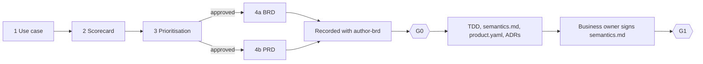

# Define and Design templates

Templates for the first two stages of a data product, from a candidate use case to a design
that passes G1.

- **Define** turns an idea into approved business requirements. Business people fill in
  these documents, so they are fillable PDFs written in business language.
- **Design** turns the approved requirements into a technical design. Data engineers write
  these documents in Markdown and YAML, in the repository, where `dpf` checks them.



## The templates

| Stage | Step | Template | Filled in by | Result | Worked example |
|---|---|---|---|---|---|
| Define | 1 | [`define/1-use-case.pdf`](define/1-use-case.pdf) | business sponsor | one candidate use case, described | [UC-SALES-001](../examples/sales_performance/define/use-case.pdf) |
| Define | 2 | [`define/2-scorecard.pdf`](define/2-scorecard.pdf) | scoring panel | value and ease scores for up to five use cases | [UC-SALES-001](../examples/sales_performance/define/scorecard.pdf); [seed portfolio](../examples/use-case-portfolio/scorecard.pdf) |
| Define | 3 | [`define/3-prioritisation.pdf`](define/3-prioritisation.pdf) | decision forum | the matrix and a signed decision for each use case | [UC-SALES-001](../examples/sales_performance/define/prioritisation.pdf); [seed portfolio](../examples/use-case-portfolio/prioritisation.pdf) |
| Define | 4a | [`define/4a-brd.pdf`](define/4a-brd.pdf) | business owner | business requirements, or ... | [BRD-SALES-002](../examples/sales_performance/define/brd.pdf) |
| Define | 4b | [`define/4b-prd.pdf`](define/4b-prd.pdf) | product manager | ... product requirements, with the same rubric | none yet |
| Design | 5 | [`design/tdd-spec.md`](design/tdd-spec.md) | data engineer | the technical design: one decision for each design area | [TDD-SALES-002](../openspec/specs/products/sales/sales-performance/tdd/spec.md) |
| Design | 5 | [`design/semantics.md`](design/semantics.md) | data engineer; signed by the business owner | the design played back in business language | [sales-performance](../openspec/specs/products/sales/sales-performance/tdd/semantics.md) |
| Design | 5 | [`design/product.yaml`](design/product.yaml) | data engineer | the resolved design (contract `product-manifest.v1`) | [sales_performance](../products/sales_performance/product.yaml) |
| Design | 5 | [`design/adr.md`](design/adr.md) | data engineer | a record of each departure from a platform default | [ADR-SALES-002-01](../products/sales_performance/adr/ADR-SALES-002-01-kimball-in-silver.md), [ADR-SALES-002-02](../products/sales_performance/adr/ADR-SALES-002-02-watermark-not-cdc.md) |

Each PDF opens with a "How to fill this in" box and ends with the next step. The Design
templates carry their guidance in comments, which you delete when you finish. Placeholders
are `{like this}` in Markdown and `<like this>` in YAML (the ADR front matter and
`product.yaml`), because YAML reads a value that starts with a brace as a mapping.

> [!TIP]
> GitHub shows a PDF in the browser: click a link in the table above. In a local clone,
> open the PDFs in a PDF reader. An editor preview often cannot show them. The worked
> examples exist only in the framework repository: `dpf init` copies `templates/` into a new
> workspace, but not the examples, so those links do not work there.

## Scoring and prioritisation

The scorecard rates each use case from 1 (worst) to 5 (best) on 11 weighted criteria. The
scoring guide on page 1 describes a 1, a 3 and a 5 for each criterion, so that a score means
the same thing to everyone.

| Axis | Criteria (default weight) |
|---|---|
| **Value**: how much does it matter? | Supports corporate strategy (5), Builds on a strength (2), Reduces a weakness (2), Defends against a threat (4), Increases profit (2), Increases revenue (3), Increases the number of customers (4) |
| **Ease**: how easily can we deliver it? | Small financial investment (2), Small time investment (3), Data readiness (4), Low delivery risk (3) |

Data readiness and delivery risk are new to this framework; the other nine criteria come
from the seed use-case template. For each axis:

```text
axis score = sum of (weight x score) for the axis / sum of the axis weights
```

The prioritisation matrix places each use case by its two axis scores. A score of 3.0 or
more is high.

| Quadrant | Value | Ease | Suggested action |
|---|---|---|---|
| Quick win | high | high | Approve and start. Write the BRD or PRD. |
| Strategic bet | high | low | Approve for discovery. Plan the funding and reduce the risk first. |
| Fill-in | low | high | Do it when there is capacity, or bundle it with related work. |
| Deprioritise | low | low | Park it. Look again if circumstances change. |

The quadrant only suggests an action. The people who sign the decision record decide.

**Change the weights or the wording.** For one scoring round, write the new weights in the
scorecard's Weight column. The axis divisors are the sums of the weights you use. To change
the defaults for everyone, edit [`scoring.yaml`](scoring.yaml), raise its `version` and run
`make templates`.

## BRD or PRD

The business chooses one. Both answer the same rubric (groups A to K in
`registry/brd-rubric.yaml`) and either one feeds the technical design.

- Record the approved document in the repository with the `author-brd` skill, as
  `openspec/specs/products/<domain>/<product>/brd/spec.md` and `brd.yaml`. Then run
  `dpf brd validate <product>` (G0) and take any gaps back to the business.
- **A PRD is recorded as a BRD.** Keep the number: `PRD-SALES-003` becomes `BRD-SALES-003`,
  and the Purpose line names the source document, for example
  `**Source:** PRD-SALES-003 v1.0.0`. Product summary, success measures, releases and risks
  stay in the PRD.
- **Link the use case.** Put it on the Purpose line, for example
  `**Use case:** UC-SALES-001`. G0 reads only the BRD id and version from that line, so
  extra keys do no harm.
- **Read a filled PDF.** The form fields have stable names, for example `purpose`,
  `questions.1.text` and `requirements.1.statement`:

  ```python
  from pypdf import PdfReader
  answers = {k: v.get("/V") for k, v in PdfReader("4a-brd.pdf").get_fields().items()}
  ```

## Design: before you run G1

The Design templates show where each rule applies. In summary, G1 passes when:

- `tdd_id` and `satisfies` agree across the TDD Purpose line, `product.yaml` and the current
  BRD version;
- every TDD decision has a unique `D-n`, cites known requirement ids, has a SHALL statement
  and a scenario, and every BRD requirement is satisfied by at least one decision;
- every gold model has a decision with **Model:** and **Grain:**, and the grain matches
  `grain_columns`;
- every element of `product.yaml` cites a requirement or a platform capability, and every
  requirement is cited by at least one element;
- each departure from `registry/platform-defaults.yaml` has an ADR, listed in `adrs`; a
  methodology departure needs `decides: methodology`;
- the BRD answers are honoured: values that must stay as they were keep point-in-time
  history, restricted attributes have policy tags, external readers get a sharing listing,
  and "stop publication" means a blocking quality gate;
- the business owner has signed `semantics.md` with `dpf signoff`, and the signature covers
  every acceptance example (AX-n).

See section 6 of the [user guide](../docs/user-guide.md) for each document in detail.

## What dpf checks

`dpf` does not read the Define documents, and no gate checks them. The checks start at G0,
when the BRD is recorded in the repository. The Design templates are checked once you copy
them into place: the TDD and `semantics.md` at G1, `product.yaml` by `dpf validate` and at
G1, and ADRs by `dpf validate`.

## Worked examples

| Example | Shows |
|---|---|
| [`examples/use-case-portfolio/`](../examples/use-case-portfolio/README.md) | the seed template's three use cases, scored and placed on the matrix |
| [`examples/sales_performance/define/`](../examples/sales_performance/define/README.md) | one use case, UC-SALES-001, traced to BRD-SALES-002 and TDD-SALES-002 |

## Rebuild the PDFs

```bash
pip install --require-hashes -r requirements/templates.txt
make templates
```

| Source | Holds |
|---|---|
| `src/*.form.yaml` | the wording and fields of each Define document |
| [`scoring.yaml`](scoring.yaml) | criteria, weights, scoring guides, threshold and quadrants |
| `src/style.css` | the look |
| `src/render.py` | the renderer (WeasyPrint and pypdf) |

The renderer writes the blank templates to `define/` and the filled worked examples beside
their example folders. Rendering the same sources twice gives identical files.
