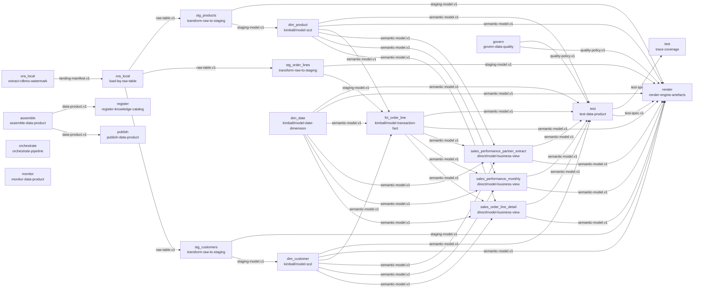

# Composed pipeline — sales_performance

Generated by `dpf compose`. Each node is a skill selected for a stage instance; each edge is typed by the contract it carries.

| Stage | Instance | Skill | Tool (tier) | Consumes | Produces |
|---|---|---|---|---|---|
| extract | ora_local | `extract-rdbms-watermark` | bespoke-code (5) | source-binding.v1 | landing-manifest.v1, raw-table.v1 |
| land | ora_local | `load-bq-raw-table` | dpf-local (4) | landing-manifest.v1 | raw-table.v1 |
| stage | stg_customers | `transform-raw-to-staging` | dpf-local (4) | raw-table.v1 | staging-model.v1 |
| stage | stg_products | `transform-raw-to-staging` | dpf-local (4) | raw-table.v1 | staging-model.v1 |
| stage | stg_order_lines | `transform-raw-to-staging` | dpf-local (4) | raw-table.v1 | staging-model.v1 |
| integrate | dim_customer | `kimball/model-scd` | dpf-local (4) | staging-model.v1 | semantic-model.v1 |
| integrate | dim_product | `kimball/model-scd` | dpf-local (4) | staging-model.v1 | semantic-model.v1 |
| integrate | dim_date | `kimball/model-date-dimension` | dpf-local (4) | — | semantic-model.v1 |
| integrate | fct_order_line | `kimball/model-transaction-fact` | dpf-local (4) | staging-model.v1, semantic-model.v1 | semantic-model.v1 |
| consume | sales_performance_monthly | `direct/model-business-view` | dpf-local (4) | staging-model.v1, semantic-model.v1 | semantic-model.v1 |
| consume | sales_order_line_detail | `direct/model-business-view` | dpf-local (4) | staging-model.v1, semantic-model.v1 | semantic-model.v1 |
| consume | sales_performance_partner_extract | `direct/model-business-view` | dpf-local (4) | staging-model.v1, semantic-model.v1 | semantic-model.v1 |
| govern | sales_performance | `govern-data-quality` | dpf-local (4) | product-manifest.v1 | quality-policy.v1 |
| test | sales_performance | `test-data-product` | dpf-local (4) | semantic-model.v1, quality-policy.v1, acceptance.v1 | test-spec.v1, test-evidence.v1 |
| test | sales_performance | `trace-coverage` | dpf-local (4) | product-manifest.v1, test-spec.v1, test-evidence.v1 | trace-matrix.v1 |
| assemble | sales_performance | `assemble-data-product` | dpf-local (4) | product-manifest.v1, signoff.v1 | data-product.v1 |
| render | sales_performance | `render-engine-artefacts` | dpf-local (4) | semantic-model.v1, staging-model.v1, quality-policy.v1, test-spec.v1 | — |
| orchestrate | sales_performance | `orchestrate-pipeline` | terraform (4) | product-manifest.v1 | — |
| publish | sales_performance | `publish-data-product` | terraform (4) | data-product.v1, test-evidence.v1 | — |
| register | sales_performance | `register-knowledge-catalog` | knowledge-catalog-mcp (1) | data-product.v1 | catalog-registration.v1 |
| monitor | sales_performance | `monitor-data-product` | dpf-local (4) | observability-policy.v1, run-evidence.v1 | — |

Design-time skills (run before the build, gated):

- `author-brd` (define)
- `validate-brd` (define, gate G0)
- `compose-pipeline` (design)
- `kimball/design-bus-matrix` (design)
- `resolve-tdd` (design, gate G1)
